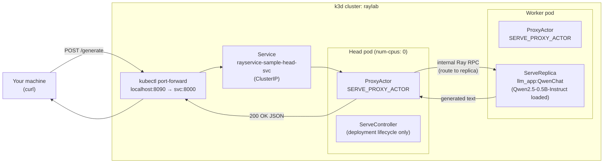
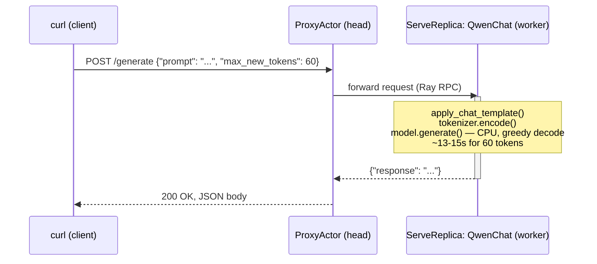

# Architecture: request flow

This diagram traces exactly what happens when you run:

```bash
kubectl port-forward svc/rayservice-sample-head-svc 8090:8000
curl -X POST -H "Content-Type: application/json" \
  http://localhost:8090/generate -d '{"prompt": "...", "max_new_tokens": 60}'
```

## Components



## Sequence



## Why the request lands on the worker, not the head

`ray-service-sample.yaml` sets `headGroupSpec.rayStartParams.num-cpus: "0"`. This tells Ray the head node has
zero schedulable CPUs, so the `QwenChat` deployment (which requests `ray_actor_options: {num_cpus: 1}`) can
never be placed there — it always lands on a worker, which has real CPU/memory headroom (`limits: {cpu: "2",
memory: "4Gi"}`) reserved for the model.

The `ProxyActor` is unaffected by that setting because it requests ~0 CPU — Ray Serve runs one proxy on
*every* node by default, head included. That's why the head's `rayservice-sample-head-svc` is still the right
thing to `port-forward` and `curl` against: its proxy is what actually receives the HTTP request and forwards
it internally to wherever the replica really lives.

## The worker's proxy is currently idle — and that's expected

Notice the worker also runs a `ProxyActor` (see `dashboard/dashboard-actors.md`), even though every request in
this setup arrives through the head's proxy and the worker's own proxy never gets touched. That's not wasted
config — it's Ray Serve's default `ProxyLocation: EveryNode` behavior, designed for production deployments
where a real load balancer or Kubernetes Service spreads incoming HTTP connections across *all* node IPs, not
just one. In that setup, any node's proxy can receive a request and route it (via Ray RPC) to whichever
replica actually holds it, wherever in the cluster that replica lives. Here, with a single `kubectl
port-forward` pointed only at the head service, that flexibility just isn't being exercised yet — it becomes
relevant once there's a second worker and replica in the picture (e.g. bumping `num_replicas` to 2), since a
production ingress path could then land a request on *either* worker's proxy and still reach the correct
replica.

See `dashboard/dashboard-actors.md` for the live actor listing this diagram is based on, and
`dashboard/dashboard-serve-inference-requests.md` for the real request-latency numbers observed.
