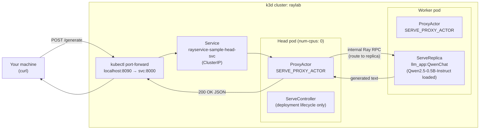
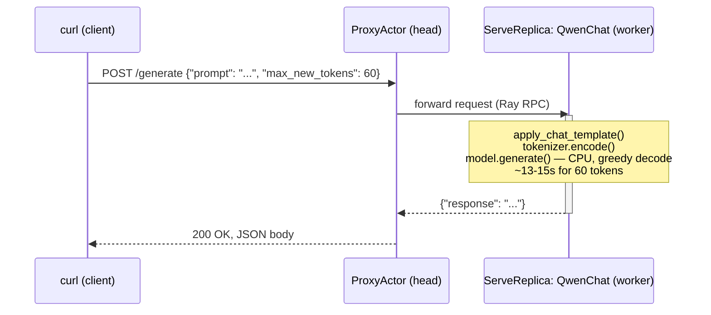
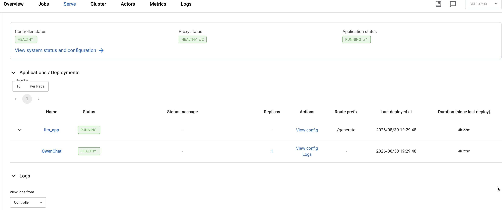
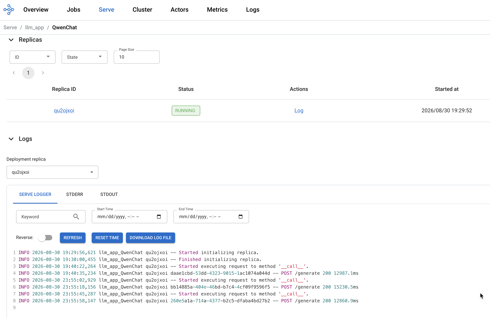
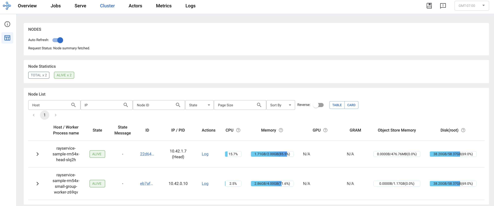
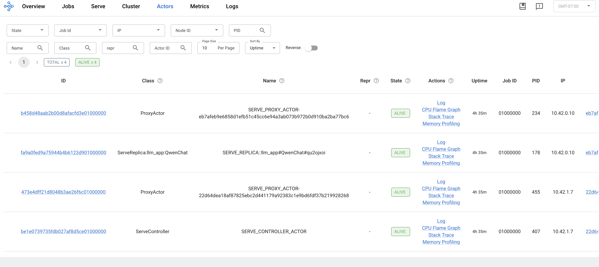

# Phase 1: single-replica Qwen on local k3d

[← back to project overview](../README.md)

A local playground for multi-node LLM serving on Kubernetes using [KubeRay](https://github.com/ray-project/kuberay)
and [Ray Serve](https://docs.ray.io/en/latest/serve/index.html). It runs a `RayService` across a multi-node
[k3d](https://k3d.io/) cluster so you can develop and debug distributed serving deployments (head + worker
autoscaling, Serve app rollout, real-model inference, etc.) without needing real cloud infrastructure or a GPU.

`ray-service-sample.yaml` serves **Qwen2.5-0.5B-Instruct** (a small, CPU-friendly instruction-tuned LLM) via a
custom Ray Serve deployment in `llm_app/serve_llm.py`, with a single model replica.

> All commands and relative paths below assume your shell is `cd`'d into this directory
> (`01-single-replica/`).

## Contents

- [Architecture: request flow](#architecture-request-flow)
  - [Components](#components)
  - [Sequence](#sequence)
  - [Why the request lands on the worker, not the head](#why-the-request-lands-on-the-worker-not-the-head)
  - [The worker's proxy is currently idle, and that's expected](#the-workers-proxy-is-currently-idle-and-thats-expected)
- [Prerequisites](#prerequisites)
- [Local development setup](#local-development-setup)
- [Getting started](#getting-started)
  - [1. Create the k3d cluster](#1-create-the-k3d-cluster)
  - [2. Install the KubeRay operator](#2-install-the-kuberay-operator)
  - [3. Build the custom Ray and Qwen image](#3-build-the-custom-ray-and-qwen-image)
  - [4. Deploy the RayService](#4-deploy-the-rayservice)
  - [5. Talk to the model](#5-talk-to-the-model)
- [Dashboard walkthrough](#dashboard-walkthrough)
  - [Serve tab: `llm_app` overview](#serve-tab-llm_app-overview)
  - [Serve tab: `QwenChat` replica detail and logs](#serve-tab-qwenchat-replica-detail-and-logs)
  - [Cluster tab: node resource usage](#cluster-tab-node-resource-usage)
  - [Actors tab: internal Serve actor breakdown](#actors-tab-internal-serve-actor-breakdown)
- [The arm64 image tag gotcha](#the-arm64-image-tag-gotcha)
- [Troubleshooting](#troubleshooting)

## Architecture: request flow

This traces exactly what happens when you run:

```bash
kubectl port-forward svc/rayservice-sample-head-svc 8090:8000
curl -X POST -H "Content-Type: application/json" \
  http://localhost:8090/generate -d '{"prompt": "...", "max_new_tokens": 60}'
```

### Components



### Sequence



### Why the request lands on the worker, not the head

`ray-service-sample.yaml` sets `headGroupSpec.rayStartParams.num-cpus: "0"`. This tells Ray the head node has
zero schedulable CPUs, so the `QwenChat` deployment (which requests `ray_actor_options: {num_cpus: 1}`) can
never be placed there — it always lands on a worker, which has real CPU/memory headroom (`limits: {cpu: "2",
memory: "4Gi"}`) reserved for the model.

The `ProxyActor` is unaffected by that setting because it requests ~0 CPU — Ray Serve runs one proxy on
*every* node by default, head included. That's why the head's `rayservice-sample-head-svc` is still the right
thing to `port-forward` and `curl` against: its proxy is what actually receives the HTTP request and forwards
it internally to wherever the replica really lives.

### The worker's proxy is currently idle, and that's expected

Notice the worker also runs a `ProxyActor` (see the Actors tab in the Dashboard walkthrough below), even
though every request in this setup arrives through the head's proxy and the worker's own proxy never gets
touched. That's not wasted config — it's Ray Serve's default
[`ProxyLocation: EveryNode`](https://docs.ray.io/en/latest/serve/api/index.html#serve-start) behavior,
designed for production deployments where a real load balancer or Kubernetes Service spreads incoming HTTP
connections across *all* node IPs, not just one. In that setup, any node's proxy can receive a request and
route it (via Ray RPC) to whichever replica actually holds it, wherever in the cluster that replica lives.
Here, with a single `kubectl port-forward` pointed only at the head service, that flexibility just isn't
being exercised yet — it becomes relevant once there's a second worker and replica in the picture (e.g.
bumping `num_replicas` to 2), since a production ingress path could then land a request on *either* worker's
proxy and still reach the correct replica.

See the Dashboard walkthrough below for the live actor listing this diagram is based on, and the real
request-latency numbers observed.

## Prerequisites

Confirmed working with:

- Docker Desktop (Docker 29.1.5)
- `kubectl` client v1.31.0+
- [k3d](https://k3d.io/) v5.9.0
- `helm` v4.2.4

If `k3d` or `helm` aren't installed yet:

```bash
brew install k3d
brew install helm
```

## Local development setup

The Ray Serve app code (`llm_app/serve_llm.py`) imports `ray`, `torch`, and `transformers`, so point your editor
at a real interpreter with those installed rather than relying on the packages baked into the Docker image:

```bash
python3 -m venv .venv
source .venv/bin/activate
pip install -r requirements.txt
```

In PyCharm: `Settings → Project: multinode-llm-serving → Python Interpreter → Add Interpreter → Add Local
Interpreter → Virtualenv Environment → Existing environment`, pointing at `.venv/bin/python`.

## Getting started

### 1. Create the k3d cluster

```bash
k3d cluster create raylab --agents 2 --port "8265:8265@loadbalancer" --port "8000:8000@loadbalancer"
```

(This is also saved as `create_cluster.sh` if you'd rather run `./create_cluster.sh`.)

This creates a cluster named `raylab` (one control-plane node + 2 agent nodes) and maps host ports `8265`
(Ray dashboard) and `8000` (Serve HTTP) to the k3d load balancer container (`k3d-raylab-serverlb`).

That mapping alone won't get you to the dashboard/Serve HTTP, though — it's worth understanding why. k3d's
load balancer does raw TCP-level port forwarding: it takes a connection on host port 8000 and forwards it to
port 8000 on the underlying node containers' network namespace, with no awareness of Kubernetes Services or
Pods. For that to reach anything, some process needs to actually be bound to port 8000 on the node itself —
which is what a [`NodePort`](https://kubernetes.io/docs/concepts/services-networking/service/#type-nodeport)
or [`hostNetwork`](https://kubernetes.io/docs/concepts/security/pod-security-standards/) Service does.
`rayservice-sample-head-svc` is a
[`ClusterIP`](https://kubernetes.io/docs/reference/networking/virtual-ips/) Service, which is a virtual,
cluster-internal-only address that
[`kube-proxy`](https://kubernetes.io/docs/concepts/overview/components/#kube-proxy) intercepts via
iptables/ipvs rules for traffic *originating inside* the pod network — it never binds a real port on the
node's host network. So the load balancer's forwarded connection has nowhere to land; you'll see it accept the TCP
connection and then return nothing (`curl: (52) Empty reply from server`). Use `kubectl port-forward` instead
(see step 5) — it tunnels through the Kubernetes API server directly to a specific Pod, bypassing node
networking (and the load balancer) entirely.

Also note: since port `8000` on your host is already claimed by that load-balancer mapping, `kubectl port-forward`
on `8000` will fail with "address already in use" — forward to a different local port instead (e.g. `8090`).

### 2. Install the [KubeRay operator](https://docs.ray.io/en/latest/cluster/kubernetes/index.html)

The operator ([source on GitHub](https://github.com/ray-project/kuberay)) is what watches `RayCluster`/
`RayService`/`RayJob` custom resources and actually creates/manages the head and worker pods behind them.
Tested with chart `kuberay-operator-1.7.0`:

```bash
helm repo add kuberay https://ray-project.github.io/kuberay-helm/
helm repo update
helm install kuberay-operator kuberay/kuberay-operator --namespace kuberay-operator --create-namespace
kubectl get pods -n kuberay-operator   # wait for 1/1 Running
```

This also installs the
[CRDs](https://kubernetes.io/docs/concepts/extend-kubernetes/api-extension/custom-resources/) (`RayCluster`,
`RayService`, `RayJob`, `RayCronJob` under the `ray.io` API group). A CRD (Custom Resource Definition) is how
Kubernetes lets a third party like KubeRay add its own object types on top of the built-in ones (`Pod`,
`Deployment`, `Service`, etc.) — once installed, `RayService` becomes a real API object with its own schema,
`kubectl get`/`describe`/`apply` all work on it exactly like they do on built-in types, and the KubeRay
operator watches it to actually create the underlying pods. Without this Helm install, `kubectl get rayservice`
would fail — that resource type genuinely doesn't exist in a stock Kubernetes cluster.

### 3. Build the custom Ray and Qwen image

`ray-service-sample.yaml` references a custom image (`multinode-llm-serving/ray-qwen:2.44.0-aarch64`) built from
the `Dockerfile` at the repo root. It starts from the official `rayproject/ray:2.44.0-aarch64` base image, installs
`torch`/`transformers`, and bakes in the Qwen2.5-0.5B-Instruct weights at build time (so pods don't need network
access to Hugging Face Hub at startup) plus the `llm_app/serve_llm.py` app code.

Build it (natively, for your host's arm64 architecture — no `--platform` flag needed):

```bash
docker build -t multinode-llm-serving/ray-qwen:2.44.0-aarch64 .
```

This downloads a few GB (torch + transformers + model weights) the first time and produces an image of about
**3.7GB**. Then import it into the k3d cluster — k3d nodes can't see your local Docker image cache otherwise:

```bash
k3d image import multinode-llm-serving/ray-qwen:2.44.0-aarch64 -c raylab
```

Re-run both commands any time you change `llm_app/serve_llm.py` or the `Dockerfile`.

### 4. Deploy the RayService

```bash
kubectl apply -f ray-service-sample.yaml
```

Key things this manifest does, beyond a minimal RayService:

- `enableInTreeAutoscaling: true` — without this, `minReplicas`/`maxReplicas` on `workerGroupSpecs` are ignored
  and the cluster stays pinned at its static `replicas` count, which can leave a Serve deployment stuck in
  `UPDATING` forever waiting for resources that will never appear.
- `headGroupSpec.rayStartParams.num-cpus: "0"` — tells Ray the head node has zero schedulable CPUs, so the
  `QwenChat` deployment replica (which requests `num_cpus: 1`) can't land on the head. The head is already busy
  running [GCS](https://docs.ray.io/en/latest/ray-core/fault_tolerance/gcs.html) (Ray's *Global Control
  Store* — its cluster metadata store, tracking actors, objects, and node membership; not to be confused with
  Google Cloud Storage), the dashboard, and the autoscaler; the Serve HTTP proxy still runs there fine since it
  needs ~0 CPU, which is how requests hitting the head service still reach the replica running on a worker.

  Note this `num-cpus: "0"` is a *different resource system* from the head container's own
  `resources.limits.cpu: "1"` below — that's a real Kubernetes/cgroup limit governing how much actual CPU the
  container's processes (GCS, dashboard, autoscaler, proxy) are allowed to use. `num-cpus` is a purely
  *logical* number that only exists inside Ray's own scheduler — Ray's docs on
  [Resources](https://docs.ray.io/en/latest/ray-core/scheduling/resources.html) are explicit that these
  numbers are "logical" and don't need any physical/OS enforcement or 1-to-1 mapping to real hardware — used
  to decide which actors/tasks Ray is allowed to place on this node. The container genuinely gets up to 1 real
  CPU from Kubernetes; Ray is
  separately told to advertise zero of that as schedulable, so its own scheduler routes `QwenChat` elsewhere.
- Worker `resources.limits: {cpu: "2", memory: "4Gi"}` — sized specifically to fit Qwen2.5-0.5B in float32.
- **`requests` vs `limits`**, in general: `requests` is what a container is *guaranteed* — the scheduler only
  places a pod on a node that has at least this much of a resource still unallocated (tracked as the sum of
  every scheduled pod's `requests` on that node, checked against the node's own reported `Allocatable`
  capacity). `limits` is the *maximum* it's allowed to use, enforced by cgroups — but CPU and memory enforce
  that ceiling very differently: exceeding a **CPU** limit just gets the container throttled (CPU is
  compressible); exceeding a **memory** limit gets the container's process killed outright by the OOM killer,
  since memory isn't compressible. That's why memory OOMs (like the one in
  [phase 2](../02-num-replicas/README.md)) are a hard kill and not a graceful slowdown. Note the head
  container's memory `request` and `limit` are identical (`2Gi` both) — no burst room, the full `2Gi` is
  reserved upfront — while its CPU `request` (`500m`) is lower than its `limit` (`1`), leaving room to burst
  if the node has spare capacity. This asymmetry (memory pinned, CPU allowed to burst) is common practice,
  precisely because a memory limit violation is destructive while a CPU one isn't.

Watch it come up. Any change to the manifest above triggers
[KubeRay's zero-downtime upgrade](https://docs.ray.io/en/latest/cluster/kubernetes/user-guides/rayservice.html):
it spins up a **complete second RayCluster** alongside the existing one, waits for it (and its Serve app) to
become healthy, switches traffic over (by updating the head service's selector to point at the new cluster),
then deletes the old cluster. During that window both clusters' pods run simultaneously, so the node pool
briefly needs roughly double the steady-state resource footprint.

```bash
kubectl get pods -o wide -w
kubectl get rayservice   # wait for SERVICE STATUS: Running, NUM SERVE ENDPOINTS non-zero
```

### 5. Talk to the model

Port-forward the stable head service (survives RayCluster upgrades) — using `8090` locally since `8000` is
already taken by the k3d load-balancer mapping from step 1:

```bash
kubectl port-forward svc/rayservice-sample-head-svc 8090:8000   # Serve HTTP
kubectl port-forward svc/rayservice-sample-head-svc 8265:8265   # dashboard, http://localhost:8265
```

Check registered routes, then prompt the model:

```bash
curl -s http://localhost:8090/-/routes
# {"/generate":"llm_app"}

curl -X POST -H "Content-Type: application/json" \
  http://localhost:8090/generate \
  -d '{"prompt": "What is Ray Serve in one sentence?", "max_new_tokens": 60}'
# {"response":"Ray Serve is an open-source framework for building scalable and efficient
#  machine learning models using Ray, a distributed computing system designed to handle
#  large-scale data processing tasks."}
```

## Dashboard walkthrough

The Ray dashboard (`http://localhost:8265` from step 5) is the best way to verify all of this is actually
healthy. Here's what each tab shows on this setup, and why it looks the way it does.

### Serve tab: `llm_app` overview



The top-level Serve tab, showing the overall health of the Ray Serve deployment on the `rayservice-sample`
cluster:

- **Controller status: HEALTHY** — the Serve controller (runs on the head node) is up and managing the
  deployment lifecycle.
- **Proxy status: HEALTHY x 2** — one HTTP proxy actor per Ray node (head + the one worker), both healthy.
- **Application status: RUNNING x 1** — the single application, `llm_app`.

Below that, the Applications/Deployments table shows `llm_app` status `RUNNING`, route prefix `/generate`, and
`QwenChat` (the deployment inside it) status `HEALTHY` with `1` replica.

This is the single best "is everything okay" screen for Ray Serve. Each piece maps directly to something in
`ray-service-sample.yaml` / `llm_app/serve_llm.py`: the route prefix matches `route_prefix: /generate` in
`serveConfigV2`; `1` replica matches `num_replicas: 1`; and **Proxy HEALTHY x 2, not x 1** is a direct
consequence of `headGroupSpec.rayStartParams.num-cpus: "0"` — even though that setting keeps the `QwenChat`
model replica off the head node, the lightweight HTTP proxy actors still run on *every* node since they need
~0 CPU. `HEALTHY` on both `llm_app` and `QwenChat` confirms the model loaded successfully — if it had failed
(e.g. an OOM or a bad Hugging Face model name), this screen would show `UNHEALTHY` or `DEPLOY_FAILED` with a
status message explaining why.

### Serve tab: `QwenChat` replica detail and logs



Drilling into `Serve / llm_app / QwenChat` shows the single running replica (`qu2ojxoi`) and its live "Serve
Logger" output:

```
1 INFO 2026-08-30 19:29:56,621 llm_app_QwenChat qu2ojxoi -- Started initializing replica.
2 INFO 2026-08-30 19:30:00,455 llm_app_QwenChat qu2ojxoi -- Finished initializing replica.
3 INFO 2026-08-30 19:40:22,264 llm_app_QwenChat qu2ojxoi -- Started executing request to method '__call__'.
4 INFO 2026-08-30 19:40:35,234 llm_app_QwenChat qu2ojxoi daae1cbd-... -- POST /generate 200 12987.1ms
5 INFO 2026-08-30 23:55:02,929 llm_app_QwenChat qu2ojxoi -- Started executing request to method '__call__'.
6 INFO 2026-08-30 23:55:18,156 llm_app_QwenChat qu2ojxoi bb14885a-... -- POST /generate 200 15230.5ms
7 INFO 2026-08-30 23:55:45,287 llm_app_QwenChat qu2ojxoi -- Started executing request to method '__call__'.
8 INFO 2026-08-30 23:55:58,147 llm_app_QwenChat qu2ojxoi 260e5a1a-... -- POST /generate 200 12860.9ms
```

Lines 1-2: replica init took ~4 seconds — that's `QwenChat.__init__` loading the tokenizer and model weights,
fast specifically because the Dockerfile bakes the weights into the image at build time (no Hugging Face Hub
download at pod startup). Lines 3-8: three separate test requests, each taking **~13-15 seconds** — the real
cost of CPU-only inference: **greedy decoding** — always picking the single highest-probability next token
(`do_sample=False`), no randomness or exploring alternatives — **of up to `max_new_tokens: 60`** — a hard cap
on generated tokens, generation can stop earlier on an end-of-sequence token — **on a single CPU core**
(`ray_actor_options.num_cpus: 1`) — since each of the 60 tokens requires its own full, sequential forward pass
through the model (token N+1 can't be computed until token N exists), with no GPU to parallelize the matrix
math inside each pass. No batching. Requests 6 and 7 don't overlap — the second only starts
(`23:55:45`) after the first fully finishes (`23:55:18`); with `num_replicas: 1` there's only one actor to
route to, so Ray Serve queues requests rather than running them concurrently (see
[phase 2](../02-num-replicas/README.md) for what changes with `num_replicas: 2`).

### Cluster tab: node resource usage



The Cluster tab's node list, showing both Ray nodes `ALIVE`:

| Host / Worker | State | CPU | Memory |
|---|---|---|---|
| `rayservice-sample-rm54x-head-slq2h` (Head) | ALIVE | 15.7% | 1.71GB / 2.00GB (85.5%) |
| `rayservice-sample-rm54x-small-group-worker-z69qv` | ALIVE | 2.5% | 2.86GB / 4.00GB (71.6%) |

Both nodes also show `Disk(root): 38.20GB/58.37GB (69.0%)`.

**Head memory at 85.5% of its `2Gi` limit** is notably tight, *especially* since the head isn't running the
model at all (`num-cpus: "0"` keeps it off) — this is pure Ray overhead: GCS, the dashboard process, the
autoscaler sidecar, and the Serve controller/proxy actors. This is the watch-item referenced in
Troubleshooting below. **Worker memory at 71.6% of its `4Gi` limit (`2.86GB` used)** is where the model
actually lives. Rough math: Qwen2.5-0.5B-Instruct has ≈494M parameters, and `serve_llm.py` loads it in
`float32` (4 bytes/param) — `494M × 4 bytes ≈ 1.98GB` of raw weights alone. The remaining ~0.9GB gap to the
observed `2.86GB` is Python/PyTorch/Transformers runtime overhead (interpreter, loaded libraries, tokenizer,
allocator buffers) — not part of the model weights themselves, but a real, unavoidable cost of running
inference this way. **Low CPU usage (15.7% / 2.5%)** reflects no inference request
in flight at the moment of this screenshot — CPU spikes near 100% on the worker's single allotted core during
an active `/generate` request. **Shared disk usage (69% on both)** isn't two separate disks — both
node-containers share the same underlying Docker Desktop VM disk.

### Actors tab: internal Serve actor breakdown



The Actors tab lists every Ray actor in the cluster — 4 total, all `ALIVE`:

| Class | Name | PID | IP |
|---|---|---|---|
| `ServeController` | `SERVE_CONTROLLER_ACTOR` | 407 | `10.42.1.7` (head) |
| `ProxyActor` | `SERVE_PROXY_ACTOR-22d64...` | 455 | `10.42.1.7` (head) |
| `ProxyActor` | `SERVE_PROXY_ACTOR-eb7af...` | 234 | `10.42.0.10` (worker) |
| `ServeReplica:llm_app:QwenChat` | `SERVE_REPLICA::llm_app#QwenChat#qu2ojxoi` | 178 | `10.42.0.10` (worker) |

This is the actual set of Ray actors behind everything shown on the Serve/Cluster tabs. `SERVE_CONTROLLER_ACTOR`
manages deployment state and always lives on the head; it doesn't touch inference traffic. The **two
`ProxyActor`s, one per node**, are the concrete actor-level reason the Serve tab showed "Proxy status: HEALTHY
x 2" — every Ray node runs one regardless of `num-cpus`, since proxies request ~0 CPU. `ServeReplica:llm_app:
QwenChat` (`qu2ojxoi`) is the one actor that actually holds the loaded model and runs `__call__` on each
request — note it's on `10.42.0.10` (the **worker**), not the head, direct confirmation that
`headGroupSpec.rayStartParams.num-cpus: "0"` successfully forced this CPU-requesting actor off the head node.

Full request path this implies: `curl` → head's `ProxyActor` (`22d64...`) → routed internally to
`ServeReplica` (`qu2ojxoi`) on the worker → response flows back through the same proxy — the concrete,
actor-level version of the architecture decision made when sizing `ray-service-sample.yaml`: keep
routing/proxy infrastructure cheap and everywhere, keep the expensive model replica confined to worker nodes
with real resource headroom.

## The arm64 image tag gotcha

On Apple Silicon (or any arm64 host), **do not use the plain `rayproject/ray:<version>` tags** — they are
amd64-only. Docker will silently pull and run the amd64 image under QEMU emulation, and the emulated binary
segfaults on startup (`qemu: uncaught target signal 11 (Segmentation fault)`), which manifests as the Ray head
pod crash-looping and worker pods stuck forever at `Init:0/1` (they're waiting on a head that never comes up).

Always pin the architecture-specific tag instead, e.g.:

```yaml
image: rayproject/ray:2.44.0-aarch64
```

Ray publishes native `-aarch64` builds for every version/variant on Docker Hub — check
[`rayproject/ray`'s tag list](https://hub.docker.com/r/rayproject/ray/tags) if you bump the Ray version and
make sure the `-aarch64` counterpart exists. This also applies to any custom
image you build on top of it (like this repo's `Dockerfile`) — build natively on your arm64 machine rather than
cross-compiling, and it'll inherit the correct architecture automatically.

## Troubleshooting

**k3d nodes share one resource pool — they aren't independent machines.** `kubectl describe nodes` reports the
same `Allocatable` CPU/memory for `k3d-raylab-server-0`, `k3d-raylab-agent-0`, and `k3d-raylab-agent-1` (on this
setup, ~16.5GB memory / 10 CPUs each) because all three are just containers backed by the *same* Docker Desktop
VM, not separate machines each with their own dedicated resources. That number is the whole shared host pool,
not per-node capacity. This matters once you're running multiple worker replicas — don't assume each worker
gets its own 16.5GB; they're all drawing from one shared pot, and Docker Desktop's own VM memory limit is the
real ceiling.

This also weakens a guarantee Kubernetes normally makes. Ordinarily, `kube-scheduler` only places a pod on a
node if that node's reported `Allocatable` capacity can cover the sum of `requests` from every pod already
there plus the new one — a real admission check, not just bookkeeping. But that check is only as trustworthy
as the `Allocatable` number itself, and here all three nodes report the *same* ~16.5GB because they're
secretly sharing one real pool. The scheduler still correctly avoids overcommitting any single node's
*reported* number, but it can't see that the three nodes aren't actually independent — so the guarantee is
real per-node-as-reported, but weaker than it looks relative to actual physical capacity. In a real multi-node
cluster (like [phase 3](../03-aws-eks/README.md)'s AWS EKS, where each node is a genuinely separate machine),
this same admission check is a much stronger guarantee.

**Head pod memory runs close to its limit even without the model on it.** In testing, the head pod sat around
85% of its `2Gi` memory limit (see the Cluster tab in the Dashboard walkthrough above) purely from GCS, the
dashboard, the autoscaler sidecar, and the Serve controller/proxy — before the `QwenChat` model replica is
even in the picture, since `num-cpus: "0"` keeps it off the head entirely. This hasn't caused an OOM, but
there's little slack. If the head pod restarts or the dashboard becomes unresponsive, bump `headGroupSpec`'s
container memory limit from `2Gi` to `3Gi` in `ray-service-sample.yaml`.
