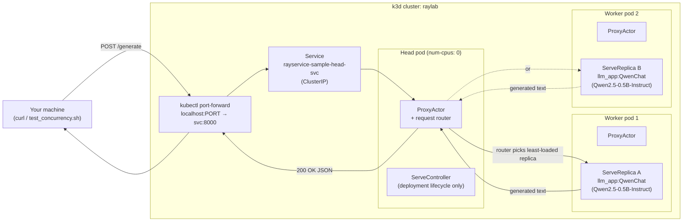
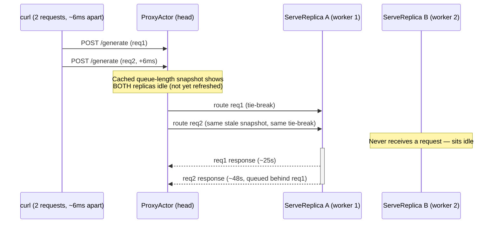
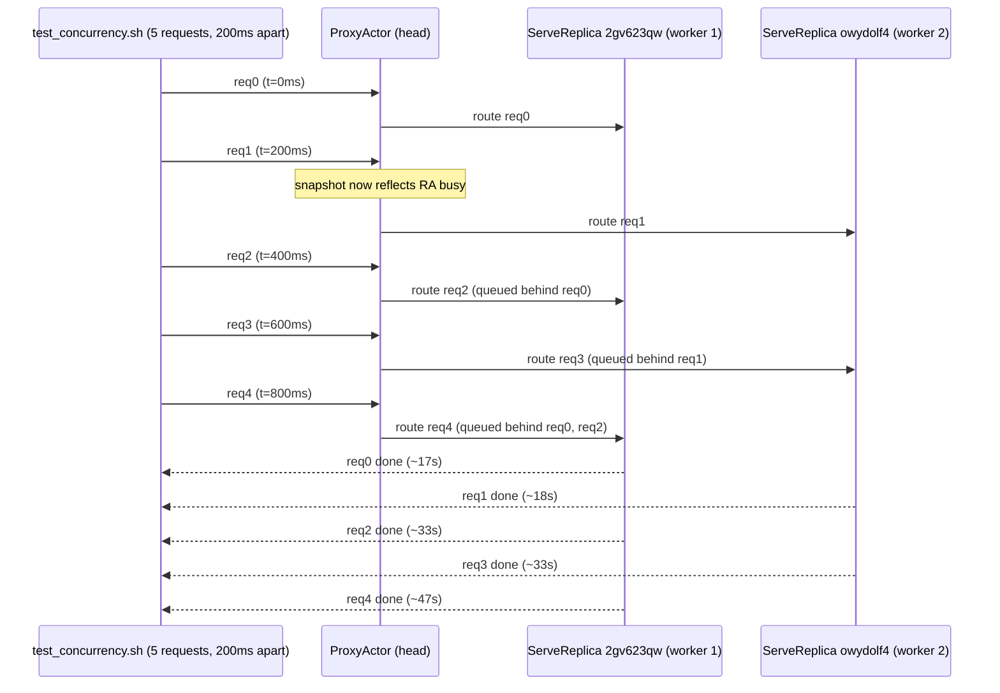

# Architecture: request flow with 2 replicas

Phase 1 ran a single `QwenChat` replica on a single worker, so every request had exactly one place to go.
Phase 2 runs `num_replicas: 2` across 2 worker pods, which introduces something phase 1 never had to deal
with: a **router** that has to decide, per request, which replica should handle it. This document covers that
decision and a surprising nuance in how it behaves under different request timing.

## Components

Same as phase 1: `headGroupSpec.rayStartParams.num-cpus: "0"` keeps both `QwenChat` replicas off the head
(each requests `num_cpus: 1`, which the head can't offer), so they always land on worker nodes. The head's
`ProxyActor` still receives every external request (that's what `rayservice-sample-head-svc` routes to) and
is responsible for picking *which* replica actually handles it — that routing decision is the new piece in
this phase.

## The router's blind spot: near-simultaneous requests pile onto one replica

Ray Serve's router doesn't synchronously check real-time in-flight-request counts on every single dispatch —
it works off a periodically-refreshed local snapshot of each replica's queue depth. Two requests arriving
within single-digit milliseconds of each other can both see the *same stale snapshot* ("both replicas idle")
and both get routed to the same replica, before that snapshot updates to reflect the first one now being busy.

This is exactly what happened testing with plain `curl ... & curl ... & wait` (no stagger):

Both requests completed successfully, but sequentially, on a single replica — `num_replicas: 2` provided zero
concurrency benefit for this specific request pattern, even though a second, fully idle replica existed the
whole time.

## Staggering fixes it: `test_concurrency.sh`'s real 3-2 split

`02-num-replicas/test_concurrency.sh` fires 5 requests 200ms apart instead of simultaneously. That gap is
enough for the router's snapshot to refresh between dispatches and correctly notice growing load, spreading
requests across both replicas:

Ground truth for this exact run (from each replica's own Serve logs, not just inference from client timing) is
in `dashboard/02-dashboard-concurrency-test.md` — replica `2gv623qw` handled req0/req2/req4, replica
`owydolf4` handled req1/req3, a genuine 3-2 split.

## Why this matters

`num_replicas: 2` alone doesn't guarantee concurrent request handling — it depends on *how* requests arrive.
A burst of near-simultaneous requests can accidentally defeat load balancing due to the router's refresh
cadence, while requests arriving even slightly spread out (as most real traffic naturally is) get properly
distributed. This is worth knowing before concluding "adding replicas didn't help" from a naive benchmark —
the benchmark's request pattern matters as much as the replica count.
