# Phase 2: multiple replicas on local k3d

[← back to project overview](../README.md)

Phase 1 ran a single `QwenChat` replica. This phase changes exactly one thing in `ray-service-sample.yaml`:

```yaml
deployments:
  - name: QwenChat
    num_replicas: 2
```

That one-line change turned into a much longer debugging story than expected, because it surfaces several
non-obvious things about how Ray's scheduler, Serve's deployment controller, and Kubernetes readiness probes
interact. This README documents the whole arc — the point isn't "here's a clean recipe," it's "here's what
actually broke and why," since that's the more useful thing to have written down.

Everything here assumes phase 1's cluster (`raylab`, KubeRay operator, the `multinode-llm-serving/ray-qwen`
image) is already set up — see [phase 1's README](../01-single-replica/README.md) if starting fresh, including
its [Local development setup](../01-single-replica/README.md#local-development-setup) section for editor/venv
setup (identical here — same `llm_app/`, same `requirements.txt`). Run commands from inside this directory.

## Contents

- [Architecture: request flow with 2 replicas](#architecture-request-flow-with-2-replicas)
- [Fixing `num_replicas: 2`](#fixing-num_replicas-2)
  - [Attempt 1: OOM, since `num_replicas: 2` alone isn't enough](#attempt-1-oom-since-num_replicas-2-alone-isnt-enough)
  - [Attempt 2: still failing after adding `memory:`, a deadlock, not a config error](#attempt-2-still-failing-after-adding-memory-a-deadlock-not-a-config-error)
- [Confirming the fix](#confirming-the-fix)
  - [Watching the autoscaler react, live](#watching-the-autoscaler-react-live)
  - [Serve tab: `llm_app` overview, 2 replicas](#serve-tab-llm_app-overview-2-replicas)
  - [Cluster tab: node resource usage, 2 workers](#cluster-tab-node-resource-usage-2-workers)
  - [Actors tab: internal actor breakdown, 2 replicas](#actors-tab-internal-actor-breakdown-2-replicas)
- [Debugging technique: replica logs without `kubectl exec`](#debugging-technique-replica-logs-without-kubectl-exec)
- [Concurrency testing](#concurrency-testing)
  - [A misleading first result](#a-misleading-first-result)
  - [The fix: stagger requests, and prove it with logs](#the-fix-stagger-requests-and-prove-it-with-logs)
  - [Serve replica logs: the concurrency test's ground truth](#serve-replica-logs-the-concurrency-tests-ground-truth)
- [Other gotchas hit along the way](#other-gotchas-hit-along-the-way)

## Architecture: request flow with 2 replicas

Phase 1 ran a single `QwenChat` replica on a single worker, so every request had exactly one place to go.
Phase 2 runs `num_replicas: 2` across 2 worker pods, which introduces something phase 1 never had to deal
with: a **router** that has to decide, per request, which replica should handle it.

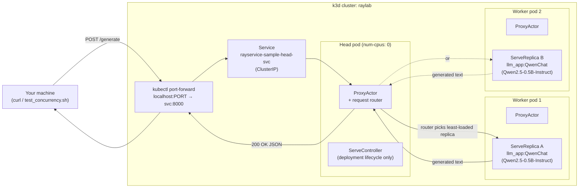

Same as phase 1: `headGroupSpec.rayStartParams.num-cpus: "0"` keeps both `QwenChat` replicas off the head
(each requests `num_cpus: 1`, which the head can't offer), so they always land on worker nodes. The head's
`ProxyActor` still receives every external request (that's what `rayservice-sample-head-svc` routes to) and
is responsible for picking *which* replica actually handles it — that routing decision is the new piece in
this phase, and the subject of the two debugging stories below.

## Fixing `num_replicas: 2`

### Attempt 1: OOM, since `num_replicas: 2` alone isn't enough

Applying the manifest with just `num_replicas: 2` bumped (no `memory` declared yet) produced this in
`kubectl get rayservice rayservice-sample -o yaml`:

```
QwenChat: status UPSCALING
message: "A replica failed to start with exception... OutOfMemoryError:
  Memory on the node ... was 3.96GB / 4.00GB (98.9%), which exceeds the
  memory usage threshold of 0.95. Ray killed this worker..."
```

**What actually happened, and why the autoscaler didn't just add a second worker:** the second replica tried
to start on the *same* existing worker pod, not a new one. `ray_actor_options` only declared `num_cpus: 1` —
no `memory` resource. The worker's container CPU limit is `2`, so with one replica already using 1 CPU,
there was CPU headroom for a second `num_cpus: 1` replica on that same node — so Ray's scheduler placed it
there instead of triggering the in-tree autoscaler to provision a new worker. Memory was never part of that
placement decision, because it was never declared as a resource requirement. Two ~2.2GB model instances got
crammed onto one `4Gi`-limited worker, and the second one got OOM-killed mid-startup.

**The gotcha worth remembering:** *Ray's memory resource, like CPU, is a scheduling hint based on what an
actor declares, not what it actually uses.* If you don't declare `memory` in `ray_actor_options`, the
scheduler has no idea a replica needs 2+ GB and will happily co-locate it with other memory-heavy actors
purely based on CPU headroom, until the OS-level memory monitor steps in after the fact and kills something.

### Attempt 2: still failing after adding `memory:`, a deadlock, not a config error

The fix looked obvious: declare the real memory cost.

```yaml
ray_actor_options:
  num_cpus: 1
  memory: 2500000000   # ~2.5GB — observed actual usage was 2.2GB
```

Re-applying still failed with the *same* OOM error, and after 6 retries the deployment settled into a
terminal state:

```
QwenChat: status DEPLOY_FAILED
message: "The deployment failed to start 6 times in a row..."
```

**Why the fix didn't immediately work:** the *already-running* replica had been scheduled under the *old*
config, before `memory` existed in `ray_actor_options`. Ray tracks resource reservations based on what an
actor declared *at the moment it was scheduled* — not its real-time actual usage. So that old replica was
still occupying ~2.2GB of real RAM while showing a **0-byte declared memory reservation** to the scheduler.
When the new, correctly-configured replica tried to start, the scheduler saw "1 of 2 CPUs used, ~0 of ~4GB
memory reserved" — looked wide open — and placed it on the same node anyway. Only the real OS memory monitor
noticed the actual overcommit and killed it, same as before.

**`DEPLOY_FAILED` doesn't self-heal.** Ray Serve's deployment controller gives up retrying after enough
consecutive failures. Deleting the stuck worker pod (`kubectl delete pod ...`) didn't fix it either — KubeRay
recreated a fresh pod, but it sat `0/1 NotReady` indefinitely. That turned out to be a **second, related
deadlock**: the worker's readiness probe requires *both* the raylet *and* Serve's `/-/healthz` to report
success, and `/-/healthz` can't report success while the deployment is `DEPLOY_FAILED`. So: Serve won't retry
on its own, and the new pod can't prove healthy until Serve does.

**The actual fix** — force a clean reschedule by stepping the deployment down and back up:

```bash
# 1. Step down to a known-good state
#    (num_replicas: 1 in ray-service-sample.yaml)
kubectl apply -f ray-service-sample.yaml
kubectl get rayservice   # wait for SERVICE STATUS: Running, NUM SERVE ENDPOINTS: 1

# 2. Step back up
#    (num_replicas: 2 in ray-service-sample.yaml)
kubectl apply -f ray-service-sample.yaml
kubectl get pods -o wide -w   # watch for a genuinely NEW second worker pod this time
```

This works because step 1 lets the surviving replica reschedule fresh *with* the memory declaration already
in effect — no more stale zero-reservation actor. Once that's true, step 2's second replica correctly finds
"no room" on the existing node (its real remaining memory, ~1.1-1.5GB, is less than the 2.5GB needed) and the
autoscaler finally provisions a real second worker.

**Sizing rule of thumb for `ray_actor_options.memory`:** pick a value such that
`replicas-per-node × memory ≈ worker's memory limit`, roughly `4Gi worker ÷ (2.5GB/replica) ≈ 1 replica/node`
after accounting for ~0.4-0.5GB of Ray's own per-node overhead (raylet, dashboard agent, etc.).

This only works if the number you declare is accurate. If you declare less memory than the replica actually
uses, Ray's scheduler will still trust your number, not reality — it'll think more replicas fit on a node
than actually do, and overcommit it the same way Attempt 1 did.

## Confirming the fix

```bash
kubectl get pods -o wide -w
kubectl get rayservice
```

Actual output from this run:

```
$ kubectl get pods -o wide -w
NAME                                               READY   STATUS    RESTARTS   AGE     IP           NODE                  NOMINATED NODE   READINESS GATES
rayservice-sample-rm54x-head-slq2h                 2/2     Running   0          7h35m   10.42.1.7    k3d-raylab-agent-1    <none>           <none>
rayservice-sample-rm54x-small-group-worker-lg5dz   1/1     Running   0          13m     10.42.0.11   k3d-raylab-server-0   <none>           <none>
rayservice-sample-rm54x-small-group-worker-rz8f6   1/1     Running   0          21m     10.42.2.6    k3d-raylab-agent-0    <none>           <none>

$ kubectl get rayservice
NAME                SERVICE STATUS   NUM SERVE ENDPOINTS
rayservice-sample   Running          3
```

Two distinct worker pods (`lg5dz` on `k3d-raylab-server-0`, `rz8f6` on `k3d-raylab-agent-0`), both `1/1
Running`, alongside the head — confirming the autoscaler genuinely provisioned a second worker this time,
rather than overcommitting the first one like in Attempt 1.

### Watching the autoscaler react, live

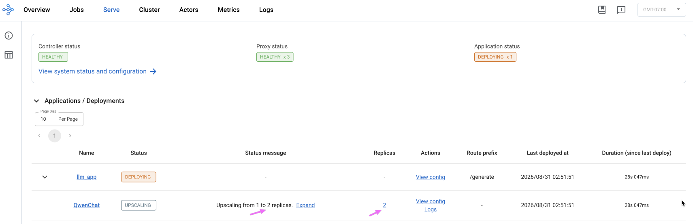

Caught mid-transition: `llm_app` status `DEPLOYING`, `QwenChat` status `UPSCALING` with the message
"Upscaling from 1 to 2 replicas," and the `Replicas` column already showing the target count of `2` before
the second worker has fully come up. A few seconds later this settles into the healthy state shown below.

### Serve tab: `llm_app` overview, 2 replicas

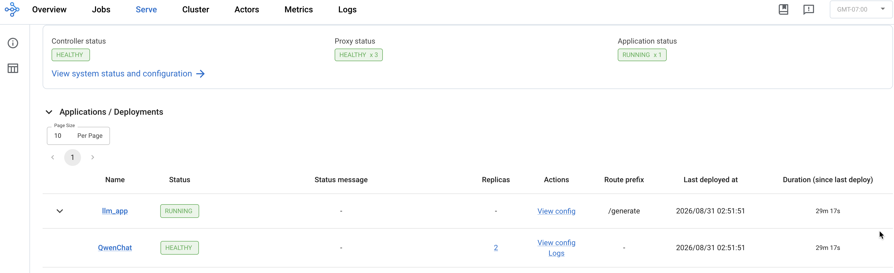

- **Controller status: HEALTHY**
- **Proxy status: HEALTHY x 3** — one proxy per Ray node, up from phase 1's `x 2` since this setup now has
  3 nodes total (1 head + 2 workers).
- **`QwenChat`: HEALTHY with 2 replicas** — the payoff screen for the whole debugging arc above (OOM →
  `DEPLOY_FAILED` deadlock → memory-aware `ray_actor_options` fix → clean restart).

### Cluster tab: node resource usage, 2 workers

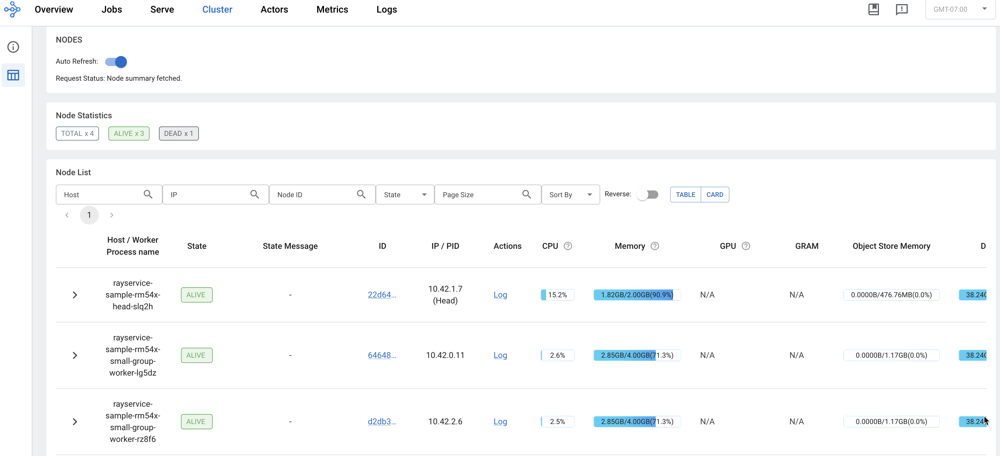

Node Statistics: `TOTAL x4, ALIVE x3, DEAD x1`. The 3 currently alive nodes:

| Host | State | CPU | Memory |
|---|---|---|---|
| `rayservice-sample-rm54x-head-slq2h` (Head) | ALIVE | 15.2% | 1.82GB / 2.00GB (90.9%) |
| `rayservice-sample-rm54x-small-group-worker-lg5dz` | ALIVE | 2.6% | 2.85GB / 4.00GB (71.3%) |
| `rayservice-sample-rm54x-small-group-worker-rz8f6` | ALIVE | 2.5% | 2.85GB / 4.00GB (71.3%) |

`DEAD x1` is a historical remnant, not a current problem — it's the original worker pod
(`small-group-worker-z69qv`) deleted during the OOM debugging and replaced by `rz8f6`. Ray's GCS keeps a
record of terminated nodes rather than erasing them. **Both workers at `2.85GB/4.00GB (71.3%)`** — nearly
identical memory footprint, exactly what we'd expect now that each replica has an explicit
`memory: 2500000000` request: two independent, equally-sized model instances, one per worker, each with
headroom to spare. **Head memory at `90.9%`** is tighter than phase 1's `85.5%` with a single worker — the
same known head-memory watch-item, just slightly worse since the autoscaler now tracks two worker nodes
instead of one. If this heads toward `100%`, bumping the head's memory limit to `3Gi` becomes the fix.

### Actors tab: internal actor breakdown, 2 replicas

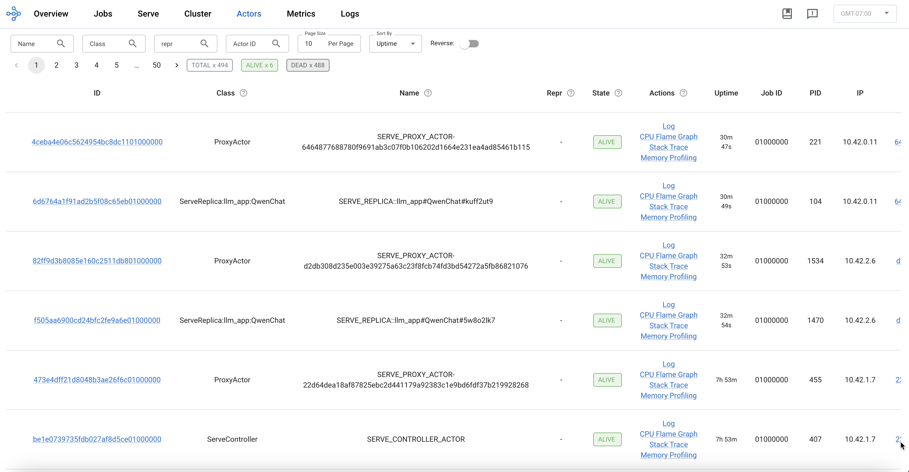

`TOTAL x494, ALIVE x6, DEAD x488`. The 6 alive actors:

| Class | PID | IP |
|---|---|---|
| `ProxyActor` | 221 | `10.42.0.11` (worker `lg5dz`) |
| `ServeReplica:llm_app:QwenChat` (`kuff2ut9`) | 104 | `10.42.0.11` (worker `lg5dz`) |
| `ProxyActor` | 1534 | `10.42.2.6` (worker `rz8f6`) |
| `ServeReplica:llm_app:QwenChat` (`5w8o2lk7`) | 1470 | `10.42.2.6` (worker `rz8f6`) |
| `ProxyActor` | 455 | `10.42.1.7` (head) |
| `ServeController` | 407 | `10.42.1.7` (head) |

`ALIVE x6` is exactly the expected composition: 3 `ProxyActor`s (one per node), 2 `ServeReplica` actors
(`kuff2ut9` and `5w8o2lk7`, one per worker), and 1 `ServeController` (always on the head) — concrete,
actor-level confirmation that both replicas are real, distinct processes on two different worker nodes, not
two logical replicas sharing one process. `DEAD x488` is a notably large number, almost certainly accumulated
churn from every failed replica-init attempt during the OOM/`DEPLOY_FAILED` cycle plus a full pod recycle
after the Mac restart — this investigation didn't trace the exact breakdown, so treat it as "high but
apparently benign churn" rather than a diagnosed root cause; cluster health elsewhere shows no adverse effect
from it, though it's worth watching on a long-lived cluster since GCS retains this history indefinitely.

## Debugging technique: replica logs without `kubectl exec`

`kubectl exec` is the Kubernetes equivalent of `docker exec` — it runs a command (or opens an interactive
shell) *inside* an already-running container, in its real filesystem and process namespace, e.g.
`kubectl exec -it <pod> -- bash`. The natural way to inspect a Serve replica's log file (which lives inside
the pod at a path like `/tmp/ray/session_latest/logs/serve/replica_....log`) would be
`kubectl exec <pod> -- cat <path>`.

`kubectl exec` access is often restricted in shared, sandboxed, or permission-locked environments, since it
grants arbitrary command execution inside a live pod — a much broader capability than read-only inspection
commands like `kubectl get`/`describe`/`logs`. If you don't have `exec` access to a cluster for this or any
other reason, the Ray dashboard exposes the same log data over its own REST API — the same API its web UI
calls when you click a replica's "Logs" link. Since reaching the dashboard only needs a normal
`kubectl port-forward` (not `exec`), this gets you the identical log content with no shell into the pod
required:

```bash
kubectl port-forward svc/rayservice-sample-head-svc 8265:8265 &
curl -s http://localhost:8265/api/serve/applications/ | python3 -c "
import json,sys
d=json.load(sys.stdin)
for app in d.get('applications', {}).values():
    for dep in app.get('deployments', {}).values():
        for r in dep.get('replicas', []):
            print(r['replica_id'], r['node_id'], r['log_file_path'])
"
# then, per replica:
curl -s "http://localhost:8265/api/v0/logs/file?node_id=<node_id>&filename=<log_file_path, no leading slash>&lines=50"
```
Note the `filename` must **not** have a leading slash, or the API returns "file not found" even though the
path looks otherwise correct.

## Concurrency testing

### A misleading first result

The obvious test — fire 2 requests at once — gave a confusing result:

```bash
time (
  curl -s -X POST ... -d '{"prompt": "What is Kubernetes?", ...}' &
  curl -s -X POST ... -d '{"prompt": "What is Ray?", ...}' &
  wait
)
# real 0m53.959s
```

53.9s for 2 "concurrent" requests, when a single request alone takes ~13-15s. Pulling each replica's actual
Serve logs (via the technique above) showed **both requests landed on the same replica**, run sequentially —
the second replica sat completely idle the whole time. `num_replicas: 2` provided zero benefit for this
specific test.

**Why:** Ray Serve's default router uses [power of two choices](https://docs.ray.io/en/latest/serve/architecture.html)
— it samples replicas and routes to whichever has fewer ongoing requests, subject to `max_ongoing_requests`.
To know a replica's current queue length, the router either uses a cached reading or actively probes the
replica and waits for a response — and Ray documents [three separate timeouts governing this](https://docs.ray.io/en/latest/serve/advanced-guides/performance.html#id8):

- `RAY_SERVE_QUEUE_LENGTH_RESPONSE_DEADLINE_S` — **0.1s (100ms) by default** — how long the router waits for
  a *fresh probe response* before falling back/retrying.
- `RAY_SERVE_MAX_QUEUE_LENGTH_RESPONSE_DEADLINE_S` — 1.0s by default — the cap on that deadline after
  exponential-backoff retries.
- `RAY_SERVE_QUEUE_LENGTH_CACHE_TIMEOUT_S` — 10s by default — how long an *already-obtained* reading stays
  valid before the router probes again.

That first number is a much better fit for what we actually observed than the 10s cache timeout: 100ms sits
right between our two data points. Two requests 6ms apart likely both arrive before the first probe for that
replica has resolved, so the router doesn't yet have anything to distinguish the replicas by — it can only
tie-break, and ties go to the same replica both times. Two requests 200ms apart give that first probe (with
its 100ms deadline) time to resolve before the second request shows up, so the router has real, differentiated
data by then. This connects a documented config value to our result, but Ray's docs don't walk through this
exact scenario step by step — treat it as a well-fitting explanation, not a confirmed one:

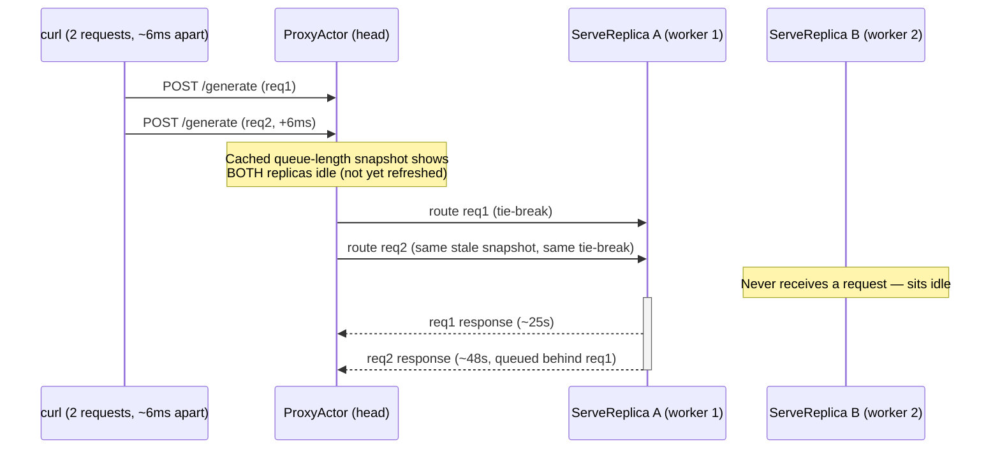

### The fix: stagger requests, and prove it with logs

`test_concurrency.sh` fires 5 requests 200ms apart instead of simultaneously — enough time for the router's
snapshot to refresh between dispatches:

```bash
./test_concurrency.sh
```

Actual output from this run:
```
$ ./test_concurrency.sh
Writing per-request output to: /var/folders/hy/6mtl1g1s34n8krcr2jzx7sbm0000gq/T/tmp.Vxxi73FDZa

=== Results ===
req0 start=1788212431 end=1788212448 duration=17s prompt="What is Kubernetes?"
req1 start=1788212431 end=1788212449 duration=18s prompt="What is Ray?"
req2 start=1788212431 end=1788212464 duration=33s prompt="What is Docker?"
req3 start=1788212431 end=1788212464 duration=33s prompt="What is Python?"
req4 start=1788212431 end=1788212479 duration=48s prompt="What is a container?"
```

The tiered pattern (two near the solo baseline, two near double, one near triple) is the signature of real
load-spreading. Ground truth, cross-checked against each replica's own logs via the dashboard, confirmed a
genuine **3-2 split**: replica `2gv623qw` handled req0/req2/req4, replica `owydolf4` handled req1/req3.

### Serve replica logs: the concurrency test's ground truth

Two screenshots of `Serve / llm_app / QwenChat`, one per replica, each showing that replica's Serve Logger
output for this exact test run:

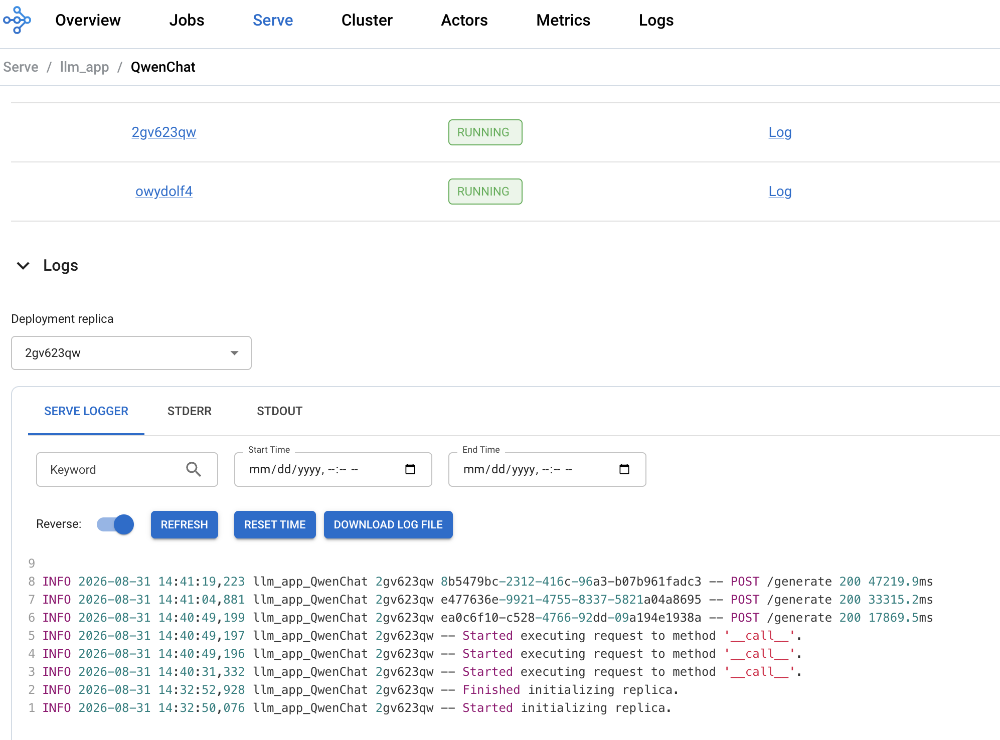

Replica `2gv623qw`:
```
14:40:31,332 -- Started executing request
14:40:49,196 -- Started executing request
14:40:49,197 -- Started executing request
14:40:49,199 -- POST /generate 200 17869.5ms
14:41:04,881 -- POST /generate 200 33315.2ms
14:41:19,223 -- POST /generate 200 47219.9ms
```

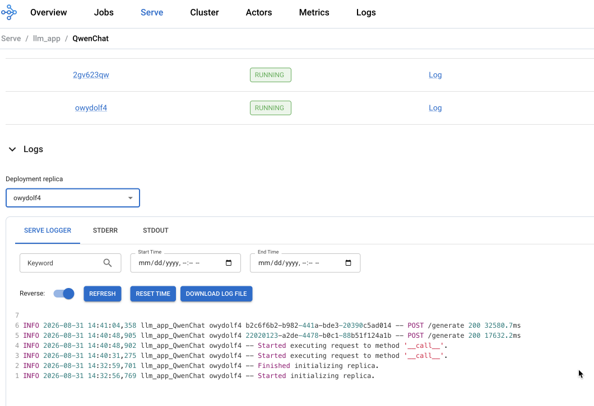

Replica `owydolf4`:
```
14:40:31,275 -- Started executing request
14:40:48,902 -- Started executing request
14:40:48,905 -- POST /generate 200 17632.2ms
14:41:04,358 -- POST /generate 200 32580.7ms
```

| Replica | Requests handled | Durations |
|---|---|---|
| `2gv623qw` | 3 | 17869.5ms, 33315.2ms, 47219.9ms → matches script's req0 (17s), req2 (33s), req4 (48s) |
| `owydolf4` | 2 | 17632.2ms, 32580.7ms → matches script's req1 (18s), req3 (33s) |

That's a genuine 3-2 split of 5 requests across both replicas, with each replica processing its own share
sequentially (each completion roughly 15-16s after the previous one on that same replica — matching a single
generation's solo latency). This is the direct rebuttal to the earlier finding that *unstaggered* concurrent
requests always piled onto a single replica: both requests saw an identical "all replicas idle" snapshot
before Ray Serve's router could refresh its view of in-flight load. The 200ms stagger gives the router enough
time between dispatches to notice growing queue depth and correctly route later requests to the less-loaded
replica — which is exactly what these two logs prove happened.

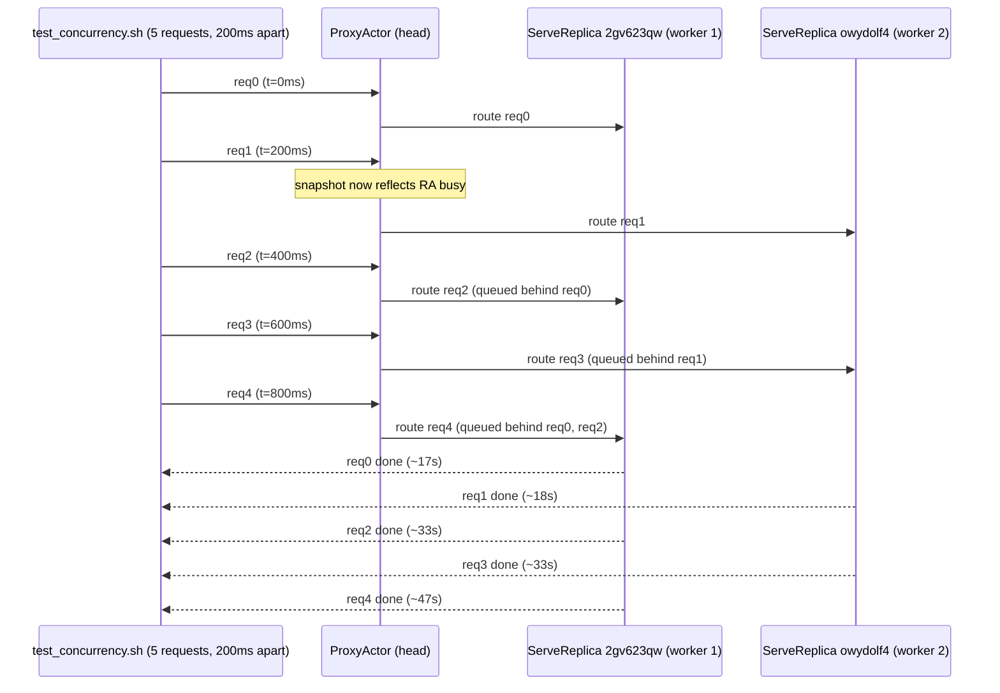

**Why this matters:** `num_replicas: 2` alone doesn't guarantee concurrent request handling — it depends on
*how* requests arrive. A burst of near-simultaneous requests can accidentally defeat load balancing (the
exact sub-second threshold is an internal implementation detail we couldn't pin down from Ray's public
docs), while requests arriving even slightly spread out — as most real traffic naturally is — get properly
distributed. This is worth knowing before concluding "adding replicas didn't help" from a naive benchmark —
the benchmark's request pattern matters as much as the replica count.

## Other gotchas hit along the way

- **A bare `wait` waits on every backgrounded job in the shell, not just the ones you care about.** My first
  two attempts at the concurrency test hung for minutes because `wait` (no arguments) was also waiting on the
  long-lived `kubectl port-forward` process, which never exits on its own. Fix: track PIDs explicitly
  (`PIDS+=($!)`) and `wait "${PIDS[@]}"`.
- **zsh doesn't support bash's `${!array[@]}` array-index syntax.** The default shell on modern Macs is zsh;
  a script using that syntax fails with `bad substitution`. `test_concurrency.sh` uses a `while read` loop
  over a heredoc instead, which works in both.
- **A confusing kubelet event message**: `Readiness probe failed: success` looks contradictory, but makes
  sense once you see the probe itself — it's a shell command chaining two checks with `&&`
  (`wget .../local_raylet_healthz | grep success && wget .../-/healthz | grep success`). The event text shows
  the output of whichever `grep` matched, even though the overall command's exit code (from the *second*,
  failing check) is what actually failed the probe.
- **k3d/Mac restart resilience (a pleasant surprise, not a gotcha):** after a full Mac restart, starting
  Docker Desktop was the only manual step needed — the k3d node containers, the RayCluster's state, and the
  locally-built `ray-qwen` image all persisted and came back up on their own, with Kubernetes restarting the
  actual Ray pods automatically once the node containers were live again.
- **Testing a real `rayClusterConfig` change on phase 2's sizing.** Any `rayClusterConfig` change (image,
  `headGroupSpec`/`workerGroupSpecs`, `enableInTreeAutoscaling`) makes KubeRay spin up a *second, complete*
  `RayCluster` alongside the existing one during its zero-downtime upgrade, so we bumped the worker memory
  *limit* slightly (`4Gi` → `4200Mi` — trivial, functionally meaningless, just enough to force a real diff)
  and watched what happened:

  ```
  $ kubectl apply -f ray-service-sample.yaml
  rayservice.ray.io/rayservice-sample configured

  $ kubectl get pods -o wide -w
  NAME                                               READY   STATUS     RESTARTS      AGE    NODE
  rayservice-sample-lm6xw-head-pz599                 1/2     Running    0             3s     k3d-raylab-agent-0
  rayservice-sample-lm6xw-small-group-worker-w82wr   0/1     Init:0/1   0             3s     k3d-raylab-server-0
  rayservice-sample-rm54x-head-slq2h                 2/2     Running    2 (35h ago)   2d6h   k3d-raylab-agent-1
  rayservice-sample-rm54x-small-group-worker-lg5dz   1/1     Running    1 (35h ago)   46h    k3d-raylab-server-0
  rayservice-sample-rm54x-small-group-worker-rz8f6   1/1     Running    1 (35h ago)   47h    k3d-raylab-agent-0
  ...   (new cluster's pods progress through Init/PodInitializing to Running)   ...
  rayservice-sample-lm6xw-small-group-worker-w82wr   1/1     Running           0             32s   k3d-raylab-server-0
  rayservice-sample-lm6xw-small-group-worker-nlkgk   1/1     Running           0             22s   k3d-raylab-agent-1
  rayservice-sample-rm54x-small-group-worker-rz8f6   1/1     Terminating       1 (35h ago)   47h   k3d-raylab-agent-0
  rayservice-sample-rm54x-head-slq2h                 2/2     Terminating       2 (35h ago)   2d6h  k3d-raylab-agent-1
  rayservice-sample-rm54x-small-group-worker-lg5dz   1/1     Terminating       1 (35h ago)   46h   k3d-raylab-server-0
  rayservice-sample-rm54x-small-group-worker-lg5dz   0/1     Error             1 (35h ago)   46h   k3d-raylab-server-0
  rayservice-sample-rm54x-small-group-worker-rz8f6   0/1     Error             1 (35h ago)   47h   k3d-raylab-agent-0
  rayservice-sample-rm54x-head-slq2h                 0/2     Error             2 (35h ago)   2d6h  k3d-raylab-agent-1
  ```
  (trimmed for brevity — the full watch stream has more intermediate status-flicker lines)

  Confirmed after settling:

  ```
  $ kubectl get raycluster
  NAME                      DESIRED WORKERS   AVAILABLE WORKERS   CPUS    MEMORY   GPUS   STATUS   AGE
  rayservice-sample-lm6xw   2                 2                   2500m   6Gi      0      ready    6m39s

  $ kubectl get pods -o wide
  NAME                                               READY   STATUS    RESTARTS   AGE     NODE
  rayservice-sample-lm6xw-head-pz599                 2/2     Running   0          6m44s   k3d-raylab-agent-0
  rayservice-sample-lm6xw-small-group-worker-nlkgk   1/1     Running   0          6m18s   k3d-raylab-agent-1
  rayservice-sample-lm6xw-small-group-worker-w82wr   1/1     Running   0          6m44s   k3d-raylab-server-0

  $ kubectl get rayservice
  NAME                SERVICE STATUS   NUM SERVE ENDPOINTS
  rayservice-sample   Running          3
  ```

  The new cluster (`lm6xw`) came up clean — both workers went straight to `Running`, no `Pending`, no stuck
  scheduling — and KubeRay completed the swap normally: old cluster's pods (`rm54x`) went `Terminating` →
  `Error`, the expected shutdown sequence for `SIGTERM`, not a crash.

  **What this confirms about resource accounting:** `kubectl get raycluster` reports `CPUS`/`MEMORY` as the
  sum of container **requests**, not limits — `2500m`/`6Gi` matches head (`500m`/`2Gi` request) + 2 workers
  (`1000m`/`2Gi` request each) exactly. Kubernetes scheduling feasibility — whether a pod can be placed at
  all, i.e. whether it goes `Pending` — is governed by requests, exactly as documented in
  [phase 1's README](../01-single-replica/README.md): "the scheduler only places a pod on a node that has at
  least this much of a resource still unallocated," checked against requests, not limits. So the real number
  at stake during this swap was `6Gi` (old) + `6Gi` (new) requests = `12Gi` — comfortably inside the shared
  pool, even though the *limits*-based total (`10Gi` steady state, `20Gi` during a swap) looks tighter.
  Limits only matter once a pod is already running, for throttling/OOM enforcement — they don't factor into
  whether it can be scheduled in the first place.

  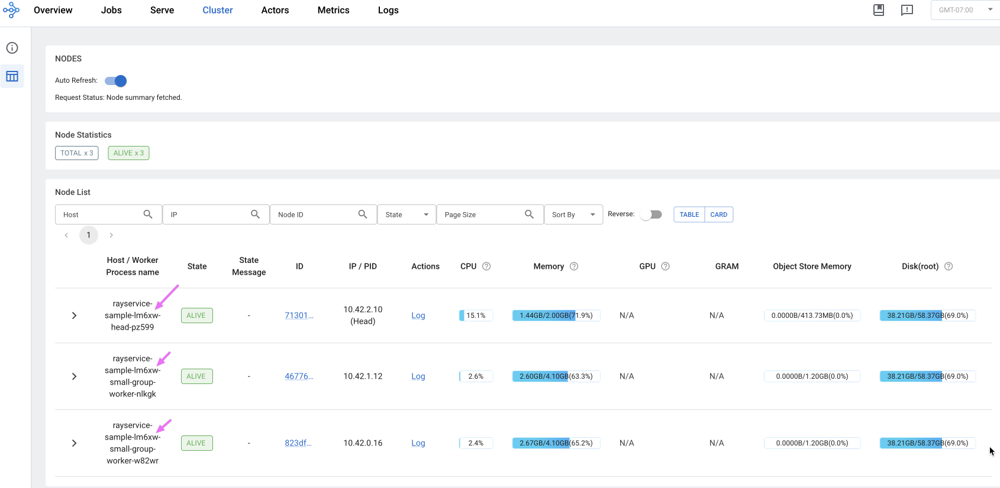

  Two more things worth noting from the new cluster's Cluster tab, a few minutes after the swap: **`TOTAL x3,
  ALIVE x3` — no `DEAD` entries at all**, unlike the earlier phase 2 cluster tab which showed `DEAD x1` from
  the pod-delete incident during OOM debugging. That history doesn't carry over because this is a genuinely
  new `RayCluster` object with its own fresh GCS — the old cluster's dead-node record lived in *that*
  cluster's GCS, which was torn down along with it. And **head memory reads notably lower here** —
  `1.44GB/2.00GB (71.9%)` versus the ~85-90% seen on the older, longer-running cluster (`2d6h` uptime vs a
  few minutes here). That supports the earlier `DEAD x488` actor-churn observation: the head's tight memory
  usage on a long-lived cluster is at least partly *accumulated* state (GCS/dashboard history, actor churn),
  not a fixed baseline cost — a fresh cluster starts meaningfully lower. (Workers show `4.10GB` as the memory
  denominator instead of `4.00GB`, correctly reflecting the temporary `4200Mi` limit used for this test.)

  **Closing confirmation, after reverting `4200Mi` back to `4Gi`:**

  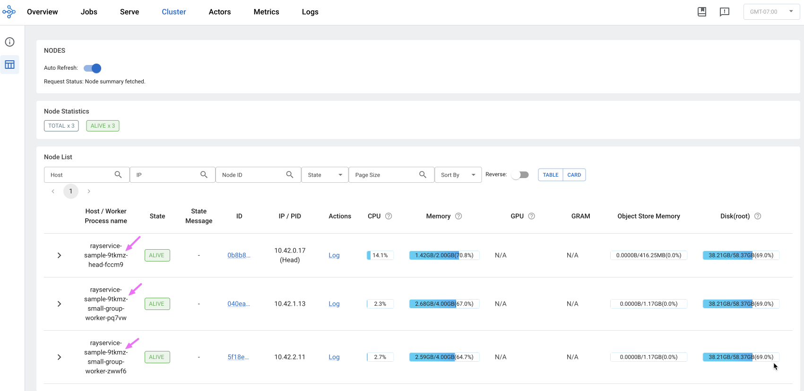

  The revert triggered its own swap (yet another new `RayCluster`, `9tkmz`), which came up just as cleanly as
  the test cluster did. Two things confirm the revert actually took effect, not just in the YAML but on the
  running containers: worker memory denominator is back to `4.00GB` (not `4.10GB`), and — matching the
  fresh-cluster pattern seen right after the test swap — `TOTAL x3, ALIVE x3` with no `DEAD` entries, plus
  head memory at `70.8%`, close to the `71.9%` seen on the previous fresh cluster and clearly below the
  ~85-90% seen on long-lived ones. A second data point for the same accumulated-state theory.
