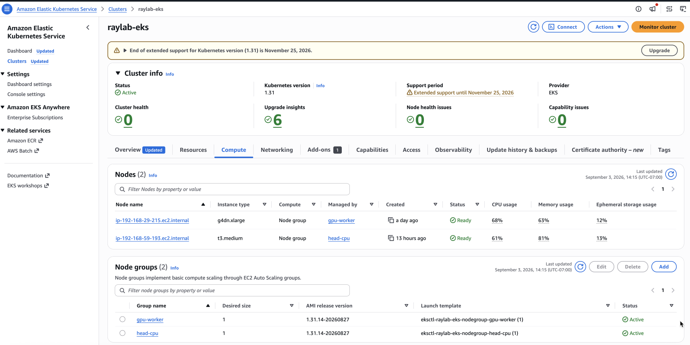
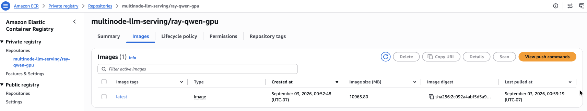
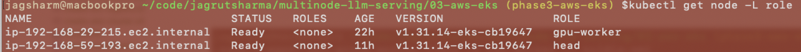
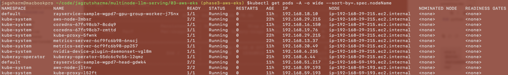
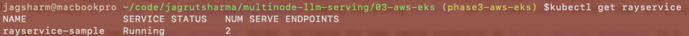
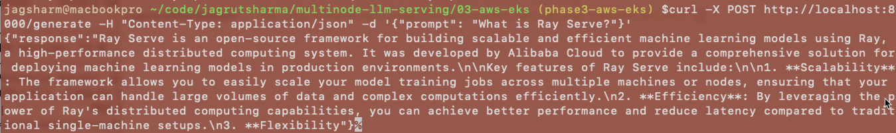
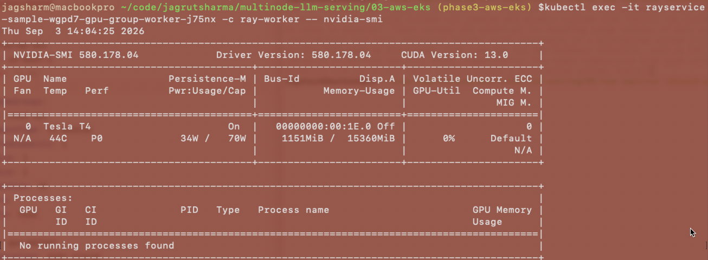
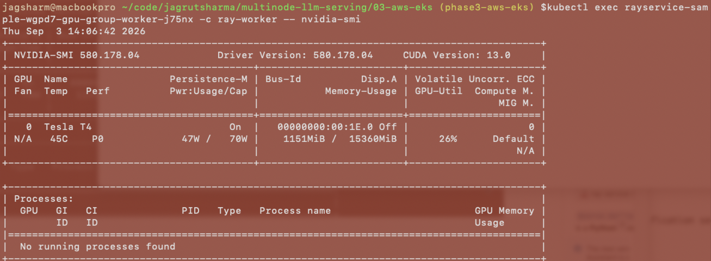
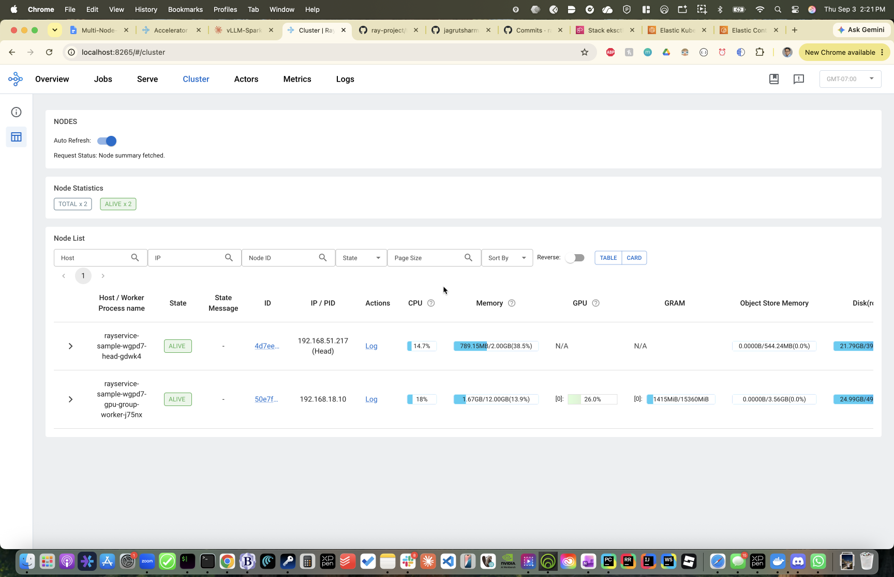

# Phase 3: AWS EKS

[← back to project overview](../README.md)

Deploy the same multi-node LLM serving workload (KubeRay + Ray Serve) to a real AWS EKS cluster, moving off
the local CPU-only k3d lab from [phase 1](../01-single-replica/README.md) onto GPU-backed nodes. Same plan as
before: a single-GPU-node RayCluster first (mirroring phase 1), then a multi-GPU-node setup (mirroring
[phase 2](../02-num-replicas/README.md)).

Unlike phases 1-2, this one costs real money the moment the cluster is up (EKS control plane ~$0.10/hr +
`t3.medium` ~$0.04/hr + `g4dn.xlarge` ~$0.53/hr On-Demand ≈ ~$0.67/hr while running) — worth tearing down
between sessions rather than leaving it running the way we did with the free local k3d cluster.

## Three layers of configuration

This phase's config spans three layers, each answering a different question, each trusting the one below
it to have already provisioned what it's asking for:

- **`eksctl-cluster.yaml`** — the real hardware ceiling. Talks to AWS, not Ray or Kubernetes. Decides what
  EC2 instances actually exist (`t3.medium`, `g4dn.xlarge`), how many, and what labels they carry. Nothing
  in the layers below can conjure resources that don't exist here.
- **`rayClusterConfig`** — Kubernetes pod specs, not "Ray handing out resources." Describes containers
  (image, `resources.requests`/`limits`, `nodeSelector`) that `kube-scheduler` places onto the real nodes
  from the layer above — the same requests-vs-limits distinction from [phase 2's live config-swap
  test](../02-num-replicas/README.md) governs what actually fits. It also sets a second, independent
  ceiling: `minReplicas`/`maxReplicas`, how many *pods* Ray's own autoscaler is allowed to ask Kubernetes
  for. Two ceilings, two layers — the pod ceiling here, the node-count ceiling in `eksctl` above — both have
  to allow growth for a worker to actually scale.
- **`serveConfigV2`** — purely internal to Ray, once processes are already running. `num_replicas` and
  `ray_actor_options` describe what Ray does with capacity it already has — the same declared-vs-actual
  accounting from [phase 2's OOM story](../02-num-replicas/README.md), except this time it's `num_gpus`
  being declared instead of `memory`. `num_gpus: 1` only means something once the node actually has a GPU
  to give it, which is what `nvidia.com/gpu` in the container's `resources` (layer above) actually secures.

eksctl doesn't know Ray exists; `rayClusterConfig` doesn't know what the model does; `serveConfigV2` doesn't
know or care that its "GPU" is a `g4dn.xlarge` in `us-east-1`.

## GPU quota

Both requests approved (2026-08-31): `All G and VT Spot Instance Requests` — 8 vCPU (partial; enough for one
`g4dn.2xlarge` or two `g4dn.xlarge`), `Running On-Demand G and VT instances` — 48 vCPU (full approval and
then some).

## Cluster: `eksctl`, not Terraform

Chose `eksctl` over Terraform to match this project's "minimal tooling, maximal understanding" style from
phases 1-2 — a single YAML config, one command, no separate state file to manage. Config
(`03-aws-eks/eksctl-cluster.yaml`):

```yaml
apiVersion: eksctl.io/v1alpha5
kind: ClusterConfig

metadata:
  name: raylab-eks
  region: us-east-1
  version: "1.31"

managedNodeGroups:
  - name: head-cpu
    instanceType: t3.medium
    desiredCapacity: 1
    minSize: 1
    maxSize: 1
    volumeSize: 20
    labels:
      role: head

  - name: gpu-worker
    instanceType: g4dn.xlarge
    desiredCapacity: 1
    minSize: 1
    maxSize: 2
    volumeSize: 50
    labels:
      role: gpu-worker
```

Two node groups, kept deliberately separate via the `role` label: a cheap CPU-only node for the Ray head +
KubeRay operator (same "keep the model off the head" pattern as phases 1-2), and a `g4dn.xlarge` (4 vCPU, 1×
NVIDIA T4 16GB GPU, ~$0.53/hr) for the actual model. Chose `g4dn.xlarge` over the newer `g5.xlarge` (~$1.01/hr,
A10G GPU) because Qwen2.5-0.5B is tiny — no reason to pay 2x for GPU memory that won't get used. `maxSize: 2`
on the GPU group costs nothing extra up front (AWS only bills running instances) and means we won't need to
touch the node group again when we get to the 2-worker phase — just `eksctl scale nodegroup` when ready.

```bash
eksctl create cluster -f eksctl-cluster.yaml
```

Took ~17 minutes. The AWS console confirms the same two node groups `kubectl` sees — real EC2 instances,
not an abstraction:



Yielded a genuine surprise: **the NVIDIA device plugin got installed automatically**, no
manual step needed —

```
[ℹ]  as you are using the EKS-Optimized Accelerated AMI with a GPU-enabled instance type, the Nvidia
     Kubernetes device plugin was automatically installed.
```

`eksctl` detected the GPU instance type, picked the GPU-optimized AMI automatically, and installed the
`nvidia-device-plugin-daemonset` for us. Confirmed for real (not just that the DaemonSet exists) by checking
the node's actual advertised capacity:

```
$ kubectl describe node -l role=gpu-worker
...
Capacity:
  nvidia.com/gpu:     1
Allocatable:
  nvidia.com/gpu:     1
```

That's the thing that actually matters — Kubernetes can genuinely schedule a GPU-requesting pod onto this
node, not just that a plugin pod is running.

## A real gotcha: `kubectl`'s context silently switches

Both `k3d` and `eksctl` follow the same convention: right after creating a cluster, they merge a new entry
into the *same shared* `~/.kube/config` file and set it as the new current-context, so `kubectl` immediately
targets the cluster you just created — no separate step. `eksctl`'s output shows the exact moment:

```
[✔]  saved kubeconfig as "/Users/jagsharm/.kube/config"
```

Practical effect: every `kubectl` command run after cluster creation now targets EKS, not the local `raylab`
k3d cluster, until explicitly switched back:

```bash
kubectl config get-contexts        # list every cluster kubectl knows about
kubectl config current-context     # show the active one
kubectl config use-context k3d-raylab           # switch back to local
```

## KubeRay operator: identical process to phase 1

```bash
helm repo add kuberay https://ray-project.github.io/kuberay-helm/
helm repo update
helm install kuberay-operator kuberay/kuberay-operator --namespace kuberay-operator --create-namespace
```

KubeRay doesn't care what's underneath it — same Helm chart, same result, just pointed at a different
cluster.

## No `k3d image import` here — need a real registry (ECR)

Locally, `k3d image import` worked because the k3d node containers run *on the laptop*, sharing visibility
into the local Docker daemon's image cache. EKS nodes are real, separate EC2 instances with zero visibility
into a laptop's Docker daemon — the image has to actually be uploaded somewhere the nodes can pull it from.
EKS node IAM roles have pull access to **Amazon ECR** by default, so that's the natural choice:

```bash
aws ecr create-repository --repository-name multinode-llm-serving/ray-qwen-gpu --region us-east-1
aws ecr get-login-password --region us-east-1 | docker login --username AWS --password-stdin <account-id>.dkr.ecr.us-east-1.amazonaws.com
docker build -t <account-id>.dkr.ecr.us-east-1.amazonaws.com/multinode-llm-serving/ray-qwen-gpu:latest .
docker push <account-id>.dkr.ecr.us-east-1.amazonaws.com/multinode-llm-serving/ray-qwen-gpu:latest
```

`docker push` is the direct replacement for `k3d image import` — it actually transfers the image's layers
over the network to the registry, which is why (combined with a much larger GPU/CUDA base image than the
CPU/arm64 one from phases 1-2) this step takes noticeably longer than anything in phases 1-2.



ECR reports the pushed image at ~11GB — smaller than the 19.2GB `docker images` showed locally, since ECR's
number is the compressed layer size actually transferred over the network, not the uncompressed size on
disk.

## GPU adaptation: image, code, and manifest changes

**Base image**: `rayproject/ray:2.44.0-gpu` instead of `rayproject/ray:2.44.0-aarch64`. Two things flip from
phase 1: this is the *plain* (amd64) architecture family now, since `g4dn.xlarge` is x86_64, not arm64 — and
it's the `-gpu` variant specifically, which bundles the CUDA runtime the local CPU-only image never needed.

**`serve_llm.py`**: three changes from the CPU version — load in `torch_dtype=torch.float16` instead of
`float32`, move the model to the GPU (`.to("cuda")`), and move the tokenized inputs to the GPU too
(`.to("cuda")`). Missing either the model or the inputs' `.to("cuda")` causes a "tensors on different
devices" crash the moment `.generate()` runs — caught this exact bug in review before the first build (the
model line was missing `torch_dtype`/`.to("cuda")` entirely while the inputs line already had it).

**Manifest** (`ray-service-sample.yaml`): two new things beyond what phases 1-2 needed —
- `nodeSelector: {role: head}` / `{role: gpu-worker}` on each pod template, since this cluster (unlike local
  k3d) has structurally different node types that need explicit separation, not just a Ray-level
  `num-cpus: "0"` hint.
- `ray_actor_options.num_gpus: 1` — Ray's own GPU resource concept, analogous to `num_cpus`. Combined with
  `resources.limits."nvidia.com/gpu": "1"` on the container (which KubeRay translates into a `--num-gpus` flag
  on the underlying `ray start` command), this tells Ray's scheduler the replica needs a GPU, not just CPU.

**Also caught before building**: a typo in the Dockerfile's model-caching step —
`AutoModelforCausalLM` (lowercase "f") imported but never used, while the correctly-spelled
`AutoModelForCausalLM` was called without ever being imported (`NameError`), plus a mistyped model ID
(`Qwen2.5.0.5B-Instruct` instead of `Qwen2.5-0.5B-Instruct`, wrong punctuation) that would have 404'd against
Hugging Face Hub. Both would have surfaced only after a multi-GB build and push — caught in review first.

## Two build-time bugs, caught by actually running the build

**`IndentationError` on the model-caching step.** The Dockerfile's `RUN python -c "..."` spanned multiple
lines joined with backslash continuations, and each continuation line had leading spaces for readability:

```dockerfile
RUN python -c "\
    from transformers import AutoModelForCausalLM, AutoTokenizer; \
    ...
```

Docker joins backslash-continued lines into one shell command, but keeps each line's leading whitespace as
literal characters. So `python -c` received a string starting with spaces before `from transformers...`,
and Python's `-c` runner treats an indented first line as a syntax error. Fix: drop the leading spaces on
each continuation line — cosmetic in a text editor, load-bearing once the lines get concatenated.

**`InvalidBaseImagePlatform` warning.** Building on an Apple Silicon (arm64) Mac, Docker's build target
defaults to the host's architecture unless told otherwise. `rayproject/ray:2.44.0-gpu` only ships `amd64`
(there's no such thing as an arm64 GPU EC2 instance here), so Docker pulled `amd64` but warned it didn't
match the arm64 build target — the same category of platform mismatch that caused the arm64/QEMU segfault
back in phase 1. Fixed by making the target explicit in `build_and_push_to_ecr.sh` rather than relying on a
default that happened to disagree with the base image:

```bash
docker build --platform linux/amd64 -t <account-id>.dkr.ecr.us-east-1.amazonaws.com/multinode-llm-serving/ray-qwen-gpu:latest .
```

## Deploying the manifest: a disk-pressure debugging chain

`kubectl apply -f ray-service-sample.yaml` (pre-validated with `kubectl apply --dry-run=server`, which
caught no issues) still hit a real problem once it ran for real: the head pod sat `Pending` indefinitely,
never assigned a node.

**First finding — the wrong taint.** `kubectl describe pod <head-pod>` showed:

```
Warning  FailedScheduling  ...  0/2 nodes are available: 1 node(s) didn't match Pod's node affinity/selector,
1 node(s) had untolerated taint {node.kubernetes.io/disk-pressure: }
```

The GPU node was expected to be excluded (it doesn't have `role: head`) — but the head-cpu node itself had a
`disk-pressure` taint, which Kubernetes applies automatically when a node's kubelet detects low disk space.
`kubectl get pods -A --field-selector spec.nodeName=<head-node>` showed why: the auto-installed
`nvidia-device-plugin-daemonset` was on that node too, `CrashLoopBackOff`, **126 restarts** over ~10 hours.

**Root cause of the crash-loop.** `kubectl get daemonset nvidia-device-plugin-daemonset -n kube-system -o yaml`
showed it had no `nodeSelector` — only a *toleration* for the `nvidia.com/gpu` taint, which lets it run on
GPU nodes but doesn't restrict it to *only* GPU nodes. With no selector at all, it was scheduled onto every
node in the cluster, including the CPU-only head node, where it found no NVIDIA device and crash-looped
continuously. A real gap in eksctl's "auto-installed the device plugin for you" convenience from earlier in
this doc — it installed correctly, but never scoped itself to the `role: gpu-worker` label that was right
there to use. Each crash/restart cycle left behind enough container/log churn to eventually trip
`DiskPressure` on the small `t3.medium` volume. Fixed by patching the DaemonSet directly:

```bash
kubectl patch daemonset nvidia-device-plugin-daemonset -n kube-system --type merge \
  -p '{"spec":{"template":{"spec":{"nodeSelector":{"role":"gpu-worker"}}}}}'
```

**Second finding, once the first was fixed — the head pod moved to `ImagePullBackOff`.** Comparing
`kubectl get node <head-node> -o jsonpath='{.status.capacity.ephemeral-storage} {.status.allocatable.ephemeral-storage}'`
against `docker images ... --format "{{.Size}}"` made the cause obvious:

| | Value |
|---|---|
| Head node disk capacity | ~19.9GB |
| Head node disk *allocatable* | ~16.9GB |
| Shared head+worker image size | 19.2GB |

The image genuinely cannot fit — not "ran low," structurally too large for a disk sized back when the head
was assumed to only ever need a small CPU-only image (true in phases 1-2, no longer true once head and
worker share the same 19.2GB GPU/torch image). Every pull attempt filled the disk and re-triggered the same
`disk-pressure` taint from the first finding. Fixed at the `eksctl-cluster.yaml` layer — the correct place,
since this is a hardware-ceiling problem, not a Kubernetes or Ray one — by bumping the head-cpu node group's
`volumeSize` from `20` to `40` and recreating just that node group:

```bash
eksctl delete nodegroup --cluster raylab-eks --name head-cpu
eksctl create nodegroup -f eksctl-cluster.yaml --include head-cpu
```

Recreating only the `head-cpu` group (not the whole cluster) briefly evicted the general-purpose pods that
happened to be running there (`coredns`, `metrics-server`, `kuberay-operator`) — they rescheduled
automatically once the new, bigger-disk node joined, but landed on the GPU node instead, since the
`gpu-worker` node group only has a *label* (`role: gpu-worker`, used by our own `nodeSelector`), not a
Kubernetes *taint* — nothing actually stops generic pods from scheduling there:

```
$ kubectl get nodes -L role
NAME                             STATUS   ROLES    AGE   VERSION                ROLE
ip-192-168-29-215.ec2.internal   Ready    <none>   22h   v1.31.14-eks-cb19647   gpu-worker
ip-192-168-59-193.ec2.internal   Ready    <none>   11h   v1.31.14-eks-cb19647   head

$ kubectl get pods -A -o wide --sort-by=.spec.nodeName
# 9 pods on gpu-worker (including coredns, metrics-server, kuberay-operator), 3 on head
```




Harmless for a lab that's about to be torn down — the GPU node still has plenty of CPU/memory headroom for a
few lightweight system pods, and none of them touch the `nvidia.com/gpu` resource. Worth knowing for a
longer-lived cluster: a real taint (not just a label) on the GPU node group would keep general workloads off
the expensive hardware.

Once both fixes landed, the RayService came up fully healthy:

```
$ kubectl get rayservice
NAME                SERVICE STATUS   NUM SERVE ENDPOINTS
rayservice-sample   Running          2
```



## Testing the deployment: proof of GPU inference

Same test as phases 1-2 — port-forward the Serve port and `curl` the endpoint, except this time it's a
GPU-backed replica on a `g4dn.xlarge`, not a CPU-only pod on a laptop:

```bash
kubectl port-forward svc/rayservice-sample-serve-svc 8000:8000
curl -X POST http://localhost:8000/generate -H "Content-Type: application/json" -d '{"prompt": "What is Ray Serve?"}'
```



It works — and produces a good, honest caveat for a project built around real findings rather than polish:
Qwen2.5-0.5B confidently claims Ray Serve "was developed by Alibaba Cloud," which is wrong (Ray originates
from UC Berkeley's RISELab, commercialized by Anyscale). The pipeline is correct; the model is just small
enough to hallucinate. Worth stating plainly rather than hiding — the plumbing works, the model's own
reliability is a separate, expected limitation of picking a tiny model for cost reasons.

**Confirming it actually ran on the GPU, not just that Kubernetes handed one a label.** `kubectl exec` into
the worker pod and run `nvidia-smi` directly — a container's own PID-namespace isolation means the
Processes table below usually can't resolve GPU activity back to a process name (a well-known `nvidia-smi`
container limitation, not a sign nothing's running), but the **Memory-Usage** and **GPU-Util** fields at the
top come straight from the driver and are fully accurate:

```bash
kubectl exec -it rayservice-sample-wgpd7-gpu-group-worker-j75nx -c ray-worker -- nvidia-smi
```



1.1GB of GPU memory held at rest — exactly what a `float16` Qwen2.5-0.5B would take, and nothing else was
using this GPU. Re-running `nvidia-smi` in a second terminal while a request was actively generating tokens
in the first confirmed the other half of the story:



Same 1.1GB footprint, now with real compute activity (26% `GPU-Util`) captured live during generation — the
idle/active pair together is the clearest possible evidence that `torch_dtype=torch.float16` +
`.to("cuda")` in `serve_llm.py` and `nvidia.com/gpu: "1"` in the manifest did what they were supposed to do.

**A second, independent source for the same finding.** The Ray dashboard's Cluster tab — the same tool used
for the dashboard walkthroughs in [phase 1](../01-single-replica/README.md) — has its own GPU column, fed by
Ray's own resource accounting rather than a raw driver call:

```bash
kubectl port-forward svc/rayservice-sample-head-svc 8265:8265
```



Captured mid-request, alongside `nvidia-smi`: `GPU [0]: 26.0%`, `GRAM 1415MiB/15360MiB`. Close to, not
identical to, the `nvidia-smi` numbers (1151MiB there vs. 1415MiB here) simply because they were sampled a
few seconds apart, not because they disagree — two different tools, one via the NVIDIA driver directly, one
via Ray's own scheduler bookkeeping, converging on the same story: a real GPU, actually in use, not just
requested on paper.
