# Phase 4: vLLM via Ray Serve LLM

[← back to project overview](../README.md)

Same model as every phase before it — Qwen2.5-0.5B-Instruct — same cluster and GPU hardware as
[phase 3](../03-aws-eks/README.md), one thing changed: the inference engine. Phase 3 served the model with
plain HuggingFace Transformers (`AutoModelForCausalLM` + `.generate()`); this phase swaps that for
[vLLM](https://github.com/vllm-project/vllm), via Ray's purpose-built
[`ray.serve.llm`](https://docs.ray.io/en/latest/serve/llm/index.html) module.

The point of this phase isn't "vLLM is faster" measured on a single request — at this model size, per-request
latency barely differs between engines. The real, honest comparison is **throughput and latency under
concurrent load**: HF
Transformers handles requests to one replica sequentially, while vLLM is built around two specific
optimizations for exactly this situation — **continuous batching** (folding new requests into an in-progress
batch instead of waiting for the current one to finish) and **paged attention** (managing the KV cache in
fixed-size blocks, like OS virtual memory pages, instead of one large contiguous allocation per request —
letting far more concurrent sequences fit in the same GPU memory). That's the axis this phase actually
tests — a concurrency sweep (1, 2, 4, 8, 16 simultaneous requests) run identically against both engines,
later extended further (up to 256) to find where a single vLLM replica actually saturates and confirm a
second replica genuinely extends that ceiling — see [Scaling to 2 GPU workers](#scaling-to-2-gpu-workers).

## Contents

- [Reusing phase 3's infrastructure](#reusing-phase-3s-infrastructure)
- [The engine swap: from `.generate()` to `ray.serve.llm`](#the-engine-swap-from-generate-to-rayservellm)
  - [The API contract changes too](#the-api-contract-changes-too)
- [Building and pushing the vLLM image](#building-and-pushing-the-vllm-image)
- [A local disk-space gotcha — not the same one from phase 3](#a-local-disk-space-gotcha--not-the-same-one-from-phase-3)
- [Deploying](#deploying)
  - [`RayService` vs. `Service` — two different layers](#rayservice-vs-service--two-different-layers)
  - [A version-pinned docs gotcha](#a-version-pinned-docs-gotcha)
  - [A second, subtler bug: asking for the same GPU twice](#a-second-subtler-bug-asking-for-the-same-gpu-twice)
  - [A third bug, but the clearest one: the wrong dtype default](#a-third-bug-but-the-clearest-one-the-wrong-dtype-default)
  - [Confirmed healthy](#confirmed-healthy)
  - [Why `LLMRouter` gets 2 replicas by default](#why-llmrouter-gets-2-replicas-by-default)
- [Benchmark methodology](#benchmark-methodology)
- [Results](#results)
- [Scaling to 2 GPU workers](#scaling-to-2-gpu-workers)
  - [Finding vLLM's saturation point](#finding-vllms-saturation-point)
- [Bonus: a small chat UI](#bonus-a-small-chat-ui)

## Reusing phase 3's infrastructure

Same EKS cluster setup (`raylab-eks`), same KubeRay operator install, same ECR account — nothing about the
Kubernetes/AWS layer conceptually changes here. See [phase 3](../03-aws-eks/README.md) for that whole setup
story (the three-layer config model, the disk-pressure debugging chain, etc.) — this doc only covers what's
new.

One deliberate choice: rather than reference phase 3's `eksctl-cluster.yaml` and scripts directly, this
folder keeps its own copies (`eksctl-cluster.yaml`, `scripts/create-eks-cluster.sh`,
`scripts/delete-cluster.sh`) — identical content, but self-contained, so this folder alone has everything
needed to reproduce the cluster without reaching into `03-aws-eks/`. Same cluster *name* and config either
way; just not shared *by reference*.

One deliberate difference from phase 3's own scaling story: for the benchmark itself, only **1 GPU worker**
is needed. The concurrency sweep tests how a single replica on a single GPU handles increasing concurrent
load — it isn't about scaling across nodes. That's a comparison of *engines* (HF vs. vLLM), each tested on
the same single GPU, not a comparison of GPUs. 2-GPU-worker scaling (mirroring phase 3's own arc) — a
separate comparison, of *replica count* rather than engine — comes later, once the HF-vs-vLLM engine
comparison is solid.

## The engine swap: from `.generate()` to `ray.serve.llm`

Phase 3's `serve_llm.py` was a hand-written `@serve.deployment` class calling HF Transformers directly.
`ray.serve.llm` replaces that entirely — no custom class, no `.generate()` call. Instead, an `LLMConfig`
object describes the model and its resource needs, and `build_openai_app` turns that config into a
complete, ready-to-serve Ray Serve application:

```python
from ray.serve.llm import LLMConfig, build_openai_app

llm_config = LLMConfig(
    model_loading_config={
        "model_id": "qwen-0.5b",
        "model_source": "Qwen/Qwen2.5-0.5B-Instruct",
    },
    accelerator_type="T4",
    placement_group_config={"bundle_per_worker": {"CPU": 1, "GPU": 1}},
    deployment_config={
        "autoscaling_config": {
            "min_replicas": 1,
            "max_replicas": 1,
        }
    },
)

app = build_openai_app({"llm_configs": [llm_config]})
```

A few things worth calling out, verified against `docs.ray.io` before building anything (a wrong value here
means a failed deploy on a running, billing cluster — not something to find out live):

- **`accelerator_type="T4"`** — confirmed as a valid value directly from Ray's `LLMConfig` API reference.
  Plays the same role phase 3's `nodeSelector: {role: gpu-worker}` did, but at the Ray-config level instead
  of the Kubernetes level.
- **`placement_group_config`** — this, not `accelerator_type`, is what actually reserves the GPU.
  `{"bundle_per_worker": {"CPU": 1, "GPU": 1}}` is the direct equivalent of phase 3's
  `ray_actor_options.num_gpus: 1` + `resources.limits."nvidia.com/gpu": "1"`, combined into one field instead
  of two separated across `serveConfigV2` and `rayClusterConfig`.
- **`model_loading_config`** splits the model into two names: `model_source` (the actual HuggingFace repo,
  same role as phase 3's `MODEL_NAME`) and `model_id` (the name the model is exposed as through the API —
  arbitrary, since `ray.serve.llm` is built to potentially serve multiple models behind one endpoint).

### The API contract changes too

Phase 3 exposed a custom `POST /generate` endpoint (`{"prompt": ...}` → `{"response": ...}`).
`ray.serve.llm` exposes an **OpenAI-compatible API** instead — `POST /v1/chat/completions`, the same
contract every OpenAI-client library already speaks. That's a real, deliberate change, not an oversight:
it's why the benchmark script and chat UI both needed rewriting for this phase (see below), and it's also
why the chat UI picked up a genuine improvement for free — see [Bonus: a small chat UI](#bonus-a-small-chat-ui).

## Building and pushing the vLLM image

```dockerfile
FROM rayproject/ray:2.44.0-gpu

RUN pip install --no-cache-dir "ray[llm]==2.44.0"

COPY llm_app/serve_vllm.py /home/ray/serve_vllm.py
```

Same base image as phase 3 — `ray[llm]` is Python's "extras" syntax, installing vLLM and the
OpenAI-compatible server stack on top of the Ray version already baked into the image. Pinned explicitly to
`==2.44.0` rather than left unversioned: an unpinned `pip install "ray[llm]"` would resolve to whatever the
*latest* release is, which could try to upgrade Ray itself mid-build — a much bigger, less predictable
change than swapping the inference engine alone.

```bash
aws ecr create-repository --repository-name multinode-llm-serving/ray-qwen-vllm --region us-east-1
aws ecr get-login-password --region us-east-1 | docker login --username AWS --password-stdin <account-id>.dkr.ecr.us-east-1.amazonaws.com
docker build --platform linux/amd64 -t <account-id>.dkr.ecr.us-east-1.amazonaws.com/multinode-llm-serving/ray-qwen-vllm:latest .
docker push <account-id>.dkr.ecr.us-east-1.amazonaws.com/multinode-llm-serving/ray-qwen-vllm:latest
```

(first two lines wrapped as [`scripts/create-ecr-registry.sh`](scripts/create-ecr-registry.sh) and
[`scripts/auth-docker-to-ecr.sh`](scripts/auth-docker-to-ecr.sh); last two as
[`scripts/build_and_push_to_ecr.sh`](scripts/build_and_push_to_ecr.sh))

Pushed to a **separate** ECR repository (`multinode-llm-serving/ray-qwen-vllm`) rather than overwriting phase
3's `ray-qwen-gpu` tag, so both images stay available side by side for the comparison. `--platform linux/amd64`
is explicit here for the same reason phase 3 needed it eventually — building on an Apple Silicon Mac
defaults to arm64 otherwise, and `rayproject/ray:2.44.0-gpu` only ships `amd64`.

## A local disk-space gotcha — not the same one from phase 3

Worth being explicit that this is a *different* disk issue than [phase 3's disk-pressure debugging
chain](../03-aws-eks/README.md#deploying-the-manifest-a-disk-pressure-debugging-chain) — that one was a live
EKS node's disk filling up; this one is entirely local, on the laptop, before the image ever reaches AWS.

`ray[llm]` pulls in a genuinely large dependency tree — torch, torchvision, torchaudio, xformers, vLLM
itself, and about a dozen separate `nvidia-*` CUDA wheels — far heavier than phase 3's `torch transformers`
install. Partway through, the build failed:

```
ERROR: Could not install packages due to an OSError: [Errno 28] No space left on device:
'/home/ray/anaconda3/lib/python3.9/site-packages/torch/jit'
```

Not a cluster problem — Docker Desktop runs its own lightweight VM locally, with its own disk allocation,
separate from the Mac's actual free disk space. `docker system df -v` showed exactly where that VM's disk
had gone: **17.48GB of accumulated build cache**, plus a full local copy of phase 3's already-pushed
`ray-qwen-gpu:latest` (**19.2GB**) sitting around for no reason — once an image is pushed to ECR, the local
copy isn't needed anymore, since EKS nodes pull from ECR directly, not from a laptop's Docker daemon.

Fixed with two safe, fully reproducible cleanups (nothing here is unique or unrecoverable):

```bash
docker builder prune -a -f
docker rmi <account-id>.dkr.ecr.us-east-1.amazonaws.com/multinode-llm-serving/ray-qwen-gpu:latest
```

Freed ~36.7GB. Also worth knowing: Docker Desktop's actual VM disk *allocation* isn't something
`docker system df` reports (it only shows usage within whatever's already allocated) — checked it directly
by asking a throwaway container to report its own filesystem size:

```bash
docker run --rm alpine df -h /
```

This showed a 58.4GB total allocation with only 34.8GB free even after cleanup — still tight for an install
this heavy. Bumped the limit in Docker Desktop's **Settings → Resources → Advanced → Virtual disk limit** to
80GB (a GUI-only setting, not exposed via the `docker` CLI), reconfirmed via the same `alpine df -h /` check
(now 53.8GB free), and retried the build from there.

The retry succeeded from there — same ~36.7GB freed by the cache/image cleanup plus the larger virtual disk
limit gave the install enough headroom to finish without further disk pressure.

## Deploying

**One real constraint shapes this whole section: only one GPU worker node exists.** Phase 3's
`rayservice-sample` and this phase's `rayservice-vllm` would both want the same single GPU via
`nodeSelector: {role: gpu-worker}` + `nvidia.com/gpu: "1"` — applying both at once means one worker pod
schedules and the other sits `Pending` forever, competing for hardware that doesn't exist twice. So the two
engines get benchmarked **sequentially, not side by side**:

```bash
# 1. HF baseline (phase 3's existing manifest, unmodified — reused, not duplicated)
kubectl apply -f ../03-aws-eks/ray-service-sample.yaml
# wait for Running, port-forward, run the HF sweep, then:
kubectl delete -f ../03-aws-eks/ray-service-sample.yaml

# 2. vLLM (this phase's manifest)
kubectl apply -f ray-service-sample.yaml
# wait for Running, port-forward, run the vLLM sweep
```

```
$ kubectl apply -f ray-service-sample.yaml
rayservice.ray.io/rayservice-vllm created
```

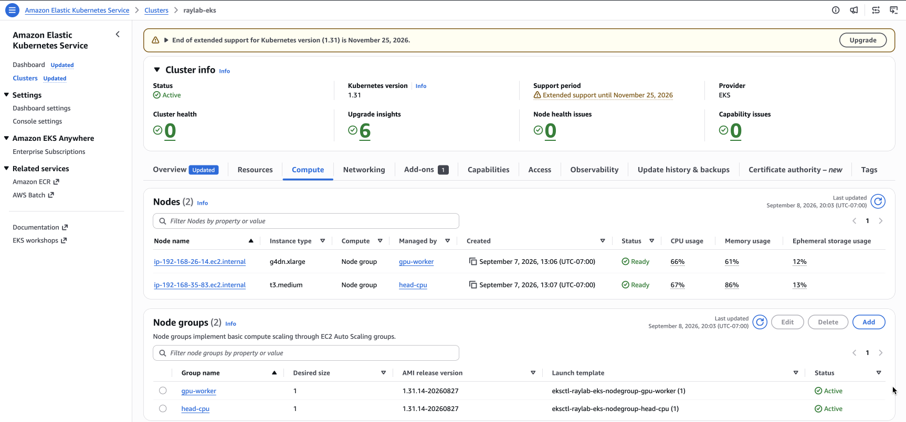

Getting from here to an actually healthy deployment took three real bugs, documented below in the order
they were found.

### `RayService` vs. `Service` — two different layers

Worth being precise about this, since the names collide: **`Service`** is a native Kubernetes object — a
stable network endpoint (virtual IP + DNS name) routing to pods matching a label selector. There's nothing
Ray-specific about it; it's the exact same kind of object you'd create for any Kubernetes app. **`RayService`**
is a Custom
Resource Definition (CRD) that only exists because KubeRay's operator defines it — the high-level thing we
actually author in `ray-service-sample.yaml` ("run this cluster, deploy this Serve app").

One `RayService` object causes KubeRay's operator to automatically generate several real Kubernetes objects
on our behalf: a `RayCluster` object, the actual head/worker pods, and multiple `Service` objects —
including `rayservice-vllm-serve-svc`, the stable-named one actually used for traffic. That one specifically
only gets created once the Serve app reports healthy — worth keeping in mind for the three-bug deployment
chain that follows: its *absence* was itself a useful signal that the deployment hadn't actually succeeded
yet, ahead of whatever error message eventually surfaced.

`kubectl get rayservice` shows Ray-specific summary info (`SERVICE STATUS`, `NUM SERVE ENDPOINTS`) that
plain Kubernetes has no concept of — KubeRay computes and reports that itself. `kubectl get svc` only ever
shows generic networking details Kubernetes understands natively, nothing about Ray or Serve.

### A version-pinned docs gotcha

The vLLM worker pod came up `Running` but never passed its readiness probe. The actual cause only surfaced
in the Ray dashboard's Serve tab, not `kubectl logs` — the deployment itself had failed:

```
Deploying app 'llm_app' failed with exception:
...
pydantic_core._pydantic_core.ValidationError: 1 validation error for LLMConfig
placement_group_config
  Extra inputs are not permitted [type=extra_forbidden, input_value={'bundle_per_worker': {'CPU': 1, 'GPU': 1}}, input_type=dict]
```

Root cause: `placement_group_config` had been verified against Ray's **`latest`** docs earlier — but this
image is deliberately pinned to `ray[llm]==2.44.0` (the exact reasoning is in [Building and pushing the vLLM
image](#building-and-pushing-the-vllm-image) above), and `ray.serve.llm` was brand new in that release. Its
`LLMConfig` schema at that specific version turned out to be simpler than what "latest" describes now —
`placement_group_config` didn't exist yet. Checking "latest" docs for a dependency that's deliberately
version-pinned is exactly the kind of mismatch that only shows up at deploy time, on a live, billing
cluster — a real, avoidable gap in the earlier verification step.

Fixed by reading the actual source at the real `ray-2.44.0` git tag instead of the docs site:

```python
# before — invalid field for this version
placement_group_config={"bundle_per_worker": {"CPU": 1, "GPU": 1}}

# after — the real 2.44.0 way to declare per-replica resources
deployment_config={
    "ray_actor_options": {"num_cpus": 1, "num_gpus": 1},
    "autoscaling_config": {"min_replicas": 1, "max_replicas": 1},
}
```

`ray_actor_options` turns out to be exactly phase 3's familiar pattern (`num_cpus`, `num_gpus`) — just nested
one level inside `deployment_config` instead of being its own top-level field. Required a full rebuild and
repush of the image, since the bug was in `serve_vllm.py` itself, baked into the image at build time — not
something a manifest-only fix could resolve. No new commands, just a re-run of the same build/push step from
earlier, since `serve_vllm.py` gets `COPY`'d into the image at build time:

```bash
./scripts/build_and_push_to_ecr.sh
```

### A second, subtler bug: asking for the same GPU twice

That fix got past the config validation error, but the deployment then sat stuck at `DEPLOYING` indefinitely
— no error, no crash, just permanently pending. `ray status` on the head pod revealed why:

```bash
kubectl exec <head-pod> -c ray-head -- ray status
```

```
Usage:
 2.0/3.0 CPU
 0.0/1.0 GPU
Demands:
 {'CPU': 1.0, 'GPU': 1.0}: 1+ pending tasks/actors (1+ using placement groups)
 {'CPU': 1.0, 'GPU': 1.0} * 1, {'GPU': 1.0, 'accelerator_type:T4': 0.001} * 1 (STRICT_PACK): 1+ pending
 placement groups
```

The GPU was completely free (`0.0/1.0` used) — but the pending placement group needed **two** separate
`GPU: 1.0` bundles packed onto the same node (`STRICT_PACK`), demanding 2 GPUs total on hardware that only
has 1. This isn't a slow-loading issue; it can never resolve on its own.

Root cause, confirmed against Ray's own architecture docs: `ray.serve.llm` creates its own automatic
`{GPU: 1}` bundle per GPU worker (sized by `tensor_parallel_size × pipeline_parallel_size`, which defaults
to 1) — the deployment's own `ray_actor_options` is meant to describe the lightweight *coordinator* actor,
which should be CPU-only. Setting `num_gpus: 1` there (the previous fix, mirroring phase 3's pattern too
literally) asked for a GPU a *second* time on top of vLLM's own automatic request — 1 (ours) + 1 (vLLM's
automatic worker bundle) = 2 demanded, on a node with 1.

```python
# still wrong — double-counts the GPU
"ray_actor_options": {"num_cpus": 1, "num_gpus": 1}

# correct — the coordinator actor is CPU-only; vLLM requests its own GPU bundle automatically
"ray_actor_options": {"num_cpus": 1}
```

Two real lessons stacked here: don't trust "latest" docs for a version-pinned dependency (finding #1), and
don't assume a familiar pattern (`ray_actor_options.num_gpus`) transfers unchanged into a higher-level
abstraction (`ray.serve.llm`) that already manages GPU allocation internally (finding #2). Another full
rebuild/repush required, same reason as before.

### A third bug, but the clearest one: the wrong dtype default

The GPU-demand fix cleared the placement group deadlock, but the deployment then failed outright, three
times in a row, with an actual error this time — no digging through raw log files needed:

```
ValueError: Bfloat16 is only supported on GPUs with compute capability of at least 8.0.
Your Tesla T4 GPU has compute capability 7.5. You can use float16 instead by explicitly
setting the `dtype` flag in CLI, for example: --dtype=half.
```

vLLM defaults to `bfloat16` unless told otherwise — but the T4 (Turing architecture, compute capability 7.5)
doesn't support it at all; that needs compute capability 8.0+ (Ampere/Hopper: A10G, A100, H100, etc.). This
connects directly back to something phase 3 already got right on purpose: `serve_llm.py` explicitly loaded
the model in `torch_dtype=torch.float16`, specifically because of this exact T4 limitation. `ray.serve.llm`
has no way to know that reasoning — it just applies its own modern default, which happens to be wrong for
this specific, older GPU.

Fixed with one line, `engine_kwargs` being the field for passing options straight through to vLLM's engine:

```python
llm_config = LLMConfig(
    ...
    engine_kwargs={"dtype": "float16"},
    ...
)
```

Three bugs, three rebuild/repush cycles — but each one was a genuinely different category of mistake:
trusting the wrong docs version, misunderstanding a higher-level abstraction's resource model, and an
unstated hardware assumption baked into a library default.

### Confirmed healthy

```
$ kubectl get rayservice
NAME              SERVICE STATUS   NUM SERVE ENDPOINTS
rayservice-vllm   Running          2
```

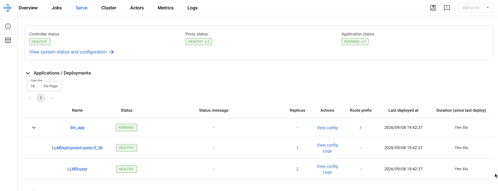

A real request confirms it end to end — genuine inference, not just a healthy-looking pod:

```
$ curl -X POST http://localhost:8000/v1/chat/completions -H "Content-Type: application/json" \
  -d '{"model": "qwen-0.5b", "messages": [{"role": "user", "content": "What is Ray Serve?"}], "max_tokens": 50}'
{"id":"qwen-0.5b-...","object":"chat.completion", ...,
 "choices":[{"message":{"content":"Ray Serve is a technology gap service offered by TNT, a Chinese
 logistics utility. ..."}}], "usage":{"prompt_tokens":34,"completion_tokens":50,"total_tokens":84}}
```

Same honest-caveat pattern as phase 3: the plumbing works, the 0.5B model itself confidently fabricates
nonsense (Ray Serve has nothing to do with a "Chinese logistics utility") — the same false-confidence
failure mode as phase 3's Alibaba Cloud hallucination, just a different noun this time.

A longer request (`max_tokens: 1000`) captured with the dashboard open shows the GPU genuinely computing,
not just idling with memory allocated:

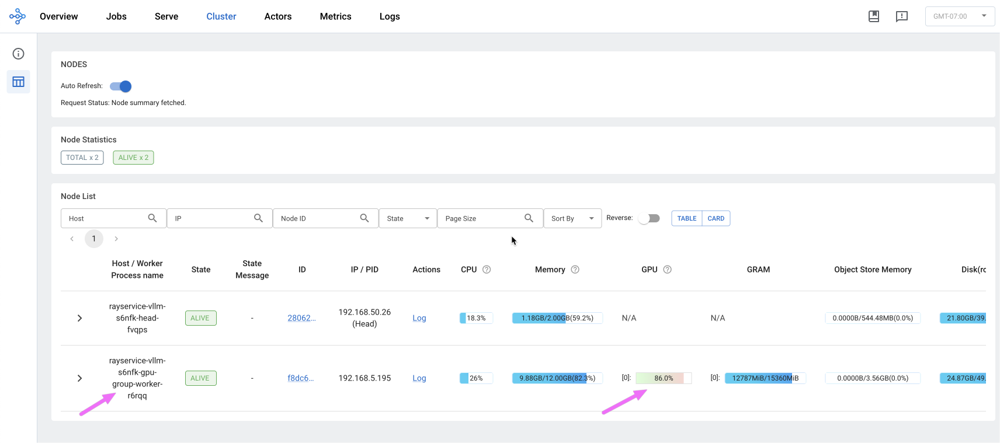

### Why `LLMRouter` gets 2 replicas by default

Worth explaining rather than just noting: `LLMRouter` defaulting to 2 replicas (while the actual model,
`LLMDeployment:qwen-0_5b`, has 1) isn't arbitrary — confirmed directly in the pinned `ray-2.44.0` source
([`constants.py`](https://github.com/ray-project/ray/blob/ray-2.44.0/python/ray/llm/_internal/serve/configs/constants.py#L70-L73)),
not "latest" docs, which already use different terminology (`num_ingress_replicas`) for what this version
still calls `ROUTER_TO_MODEL_REPLICA_RATIO`: a hardcoded 2:1 ratio of router replicas to model replicas,
[with the reasoning spelled out in a comment right next to where it's applied](https://github.com/ray-project/ray/blob/ray-2.44.0/python/ray/llm/_internal/serve/deployments/routers/router.py#L426-L428) —
router replicas are deliberately set to ~2x model replicas "during high concurrency situation," specifically
so the router layer itself can't become the bottleneck under concurrent load. The
router does real CPU work per request (parsing the incoming JSON, applying the chat template, translating
between the OpenAI API shape and vLLM's internal format, then load-balancing to a model replica via the
same "power of two choices" routing strategy from [phase 2's router-timing
investigation](../02-num-replicas/README.md)) — with only one router process, *that* could serialize
requests before they ever reach the model, even if the model replica itself has headroom.

Ground truth that both routers are genuinely handling live traffic, not just one sitting idle — each
replica's own logs show real `POST /v1/chat/completions` entries, captured during the concurrency benchmark
described next (see [Benchmark methodology](#benchmark-methodology) and [Results](#results)):

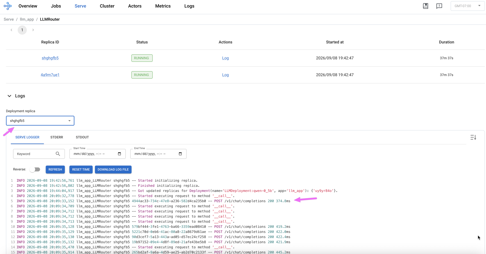
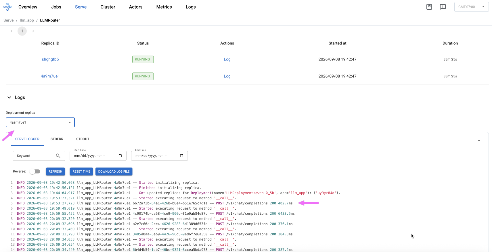

## Benchmark methodology

The sweep fires 1, 2, 4, 8, and 16 truly concurrent requests at a single replica, for each engine, and
records per-level throughput (requests/sec) and average latency. This is the HF-vs-vLLM comparison covered
in [Results](#results) below; the same `benchmark.py` script gets reused later with a much wider concurrency
range (up to 256) for the 1-vs-2-replica saturation study in [Scaling to 2 GPU
workers](#scaling-to-2-gpu-workers) — same methodology, same script, different question. A few deliberate
design choices:

- **A pool of distinct prompts, cycled across requests — not one repeated prompt.** vLLM automatically
  caches shared prompt prefixes; hammering it with the exact same prompt over and over would make it look
  faster for a reason that has nothing to do with concurrent-load handling. Using varied prompts keeps the
  comparison honest.
- **A short warmup phase before the real sweep.** The first request to a freshly started replica includes
  cold-start overhead (CUDA context initialization, etc.) that would otherwise unfairly make the
  `concurrency=1` result look slow.
- **Throughput as the primary metric**, not tokens/sec — phase 3's custom `/generate` response never
  returned a token count, so requests/sec is the metric both engines can be compared on without adding a
  tokenizer dependency to the benchmark script itself.

Script: [`scripts/benchmark.py`](scripts/benchmark.py). Run once per engine — **not back to back**, since (per
[Deploying](#deploying) above) only one engine can actually be running at a time on the single GPU worker:

```bash
# 1. HF baseline (phase 3's existing manifest, unmodified — reused, not duplicated)
kubectl apply -f ../03-aws-eks/ray-service-sample.yaml
# wait for Running, port-forward, then:
python benchmark.py --engine hf --url http://localhost:8000/generate --out results_hf.json
kubectl delete -f ../03-aws-eks/ray-service-sample.yaml

# 2. vLLM (this phase's manifest)
kubectl apply -f ray-service-sample.yaml
# wait for Running, port-forward, then:
python benchmark.py --engine vllm --url http://localhost:8000/v1/chat/completions --out results_vllm.json
```

Charting: [`scripts/plot_results.py`](scripts/plot_results.py) reads both result files and produces two
charts — throughput vs. concurrency (the main comparison) and latency vs. concurrency (supporting evidence).

## Results

| Concurrency | HF throughput (req/s) | vLLM throughput (req/s) | HF latency (s) | vLLM latency (s) |
|---|---|---|---|---|
| 1  | 0.55 | 1.55  | 1.82  | 0.65 |
| 2  | 0.59 | 3.12  | 2.61  | 0.64 |
| 4  | 0.61 | 5.76  | 4.21  | 0.69 |
| 8  | 0.62 | 10.09 | 7.39  | 0.78 |
| 16 | 0.62 | 16.82 | 13.82 | 0.92 |

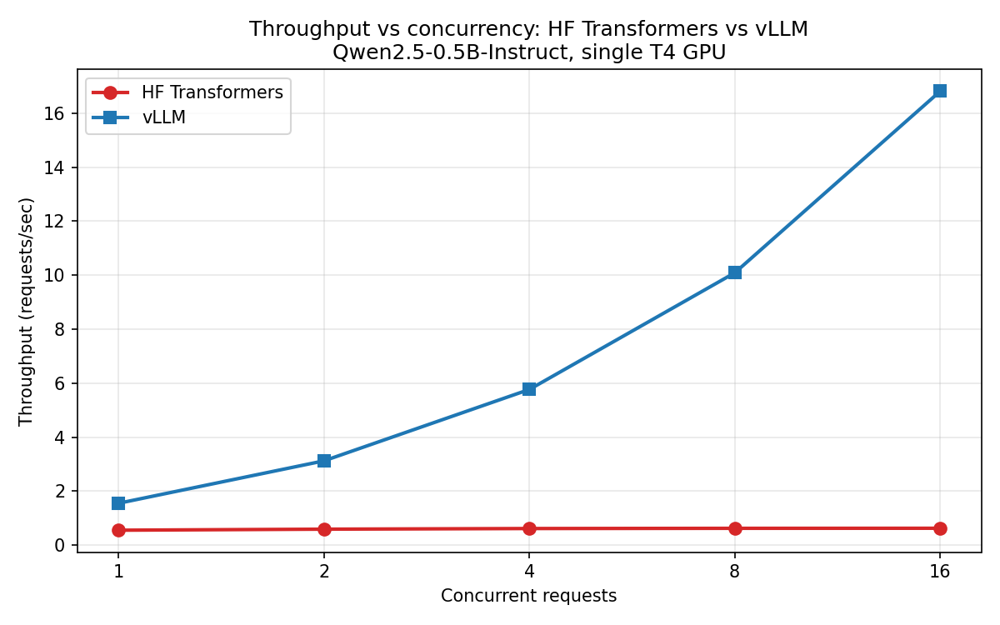
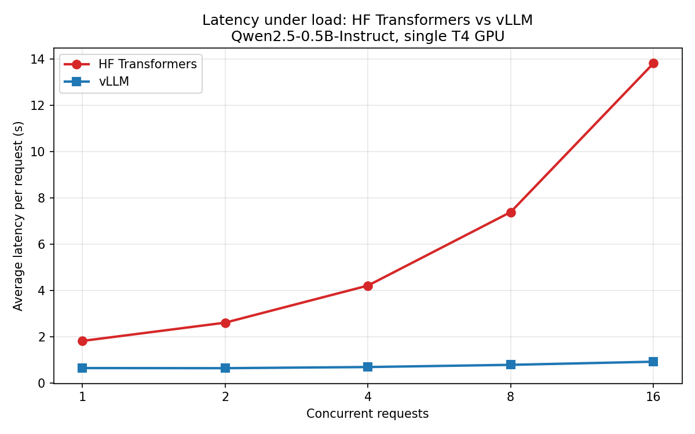

At concurrency 16, vLLM delivers **~27x the throughput** of HF Transformers (16.82 vs. 0.62 req/s), while
its latency stays almost flat (0.92s vs. HF's 13.82s — HF is ~15x slower per request under the same load).
HF's throughput line is dead flat from concurrency 1 onward — a direct signature of zero batching:
requests to one replica are handled strictly one at a time, so throughput is capped at roughly
1 ÷ (single-request latency) no matter how many requests pile up. vLLM's continuous batching instead packs
concurrent requests into shared GPU forward passes, so throughput keeps climbing as concurrency rises.

A small model like this one turns out to benefit *more* from batching than a large one might, not less:
per-request fixed overhead (Python/CUDA call overhead, KV cache allocation) is large relative to the model's
own tiny compute cost, so batching multiple requests together — which amortizes that overhead across all of
them — has more waste to reclaim. That's a plausible explanation, not a confirmed one; the actual mechanism
would need profiling to verify.

Phase 5 (same vLLM setup, a meaningfully larger model) is worth doing to see whether this pattern holds,
shrinks, or grows once per-request compute time actually dominates over fixed overhead.

## Scaling to 2 GPU workers

Mirrors phase 3's own "Scaling to 2 GPU workers" step, but this time there are **two independent
autoscaling layers** to deal with, not one:

1. **Ray's core cluster autoscaler** — decides whether to request a new *node* from Kubernetes, based on
   unmet resource demand from pending placement groups.
2. **Ray Serve's deployment-level autoscaler** (`deployment_config.autoscaling_config`) — decides how many
   *replicas* of `LLMDeployment:qwen-0_5b` to run, based on observed request queue depth. This is completely
   separate from layer 1 — it can only ever use nodes that already exist.

**Layer 1.** After scaling the node group to 2 GPU nodes (`scripts/scale-up-gpu-workers.sh`), the core
cluster autoscaler stalled for 14+ minutes despite `ray status` showing clear pending demand — a genuine,
unresolved finding, not chased further here (from contemporaneous notes at the time, not an archived
`ray status`/log capture). Worked around it by forcing `workerGroupSpecs.replicas: 2` directly, bypassing the
stalled autoscaler; both GPU pods came up fine from there.

**Layer 2.** This one turned out to be its own source of flakiness. With
`autoscaling_config: {min_replicas: 1, max_replicas: 2}`, the second Serve replica only activates under
*sustained* load — it took ~14 minutes of continuous 16-concurrent traffic the first time — and scales back
down to 1 replica within minutes of that load stopping. A short `benchmark.py` sweep (~3-4 seconds total)
doesn't generate enough sustained demand on its own to trigger scale-up, and can easily get caught
mid-scale-down. That's exactly what happened, twice: two separate attempts to benchmark the "2-replica"
deployment both produced numbers nearly identical to the 1-replica baseline — suspiciously flat, given the
whole point was to see a difference. Both times, checking the dashboard's Serve tab and `kubectl get pods`
showed only 1 active Serve replica during the actual test window; the second pod existed at the Kubernetes
level, but Serve's own autoscaler hadn't activated it yet when the benchmark ran. The first mislabeled
results file was deleted outright once this was confirmed; the second attempt is what led to deliberately
generating sustained load first (see below) to force the second replica active *before* benchmarking, rather
than hoping it happened to be up already.

For the actual measurement below, a sustained-load generator was run against the deployment's
`autoscaling_config` until the dashboard confirmed 2 replicas active, and the benchmark was fired immediately
after, before the idle scale-down window closed.

**Recap, since three different layers were involved:**

#### Node count

2 real EC2 instances now exist in the `gpu-worker` node group, via `scripts/scale-up-gpu-workers.sh`. A
Kubernetes/AWS-level change, independent of anything Ray-specific.

#### Pod count

Forced directly to 2 via `workerGroupSpecs.replicas: 2` in the RayCluster spec — not something that happened
on its own. This is exactly the step Ray's own core cluster autoscaler (layer 1) should have handled
automatically, but stalled on.

#### Serve replica count

Sustained load triggered Ray Serve's own deployment-level autoscaler (layer 2, `autoscaling_config`), scaling
`LLMDeployment:qwen-0_5b` from 1 replica to 2.

Ground truth that both replicas were genuinely live and splitting traffic:

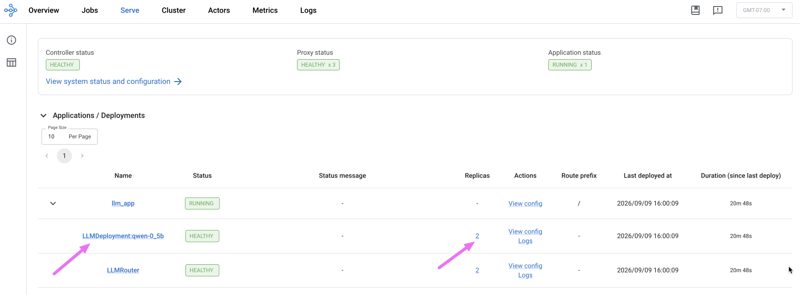
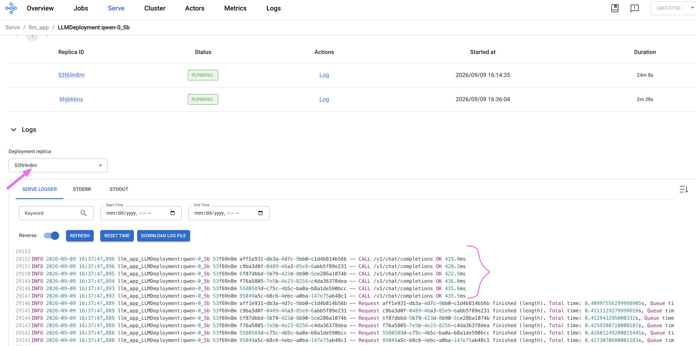
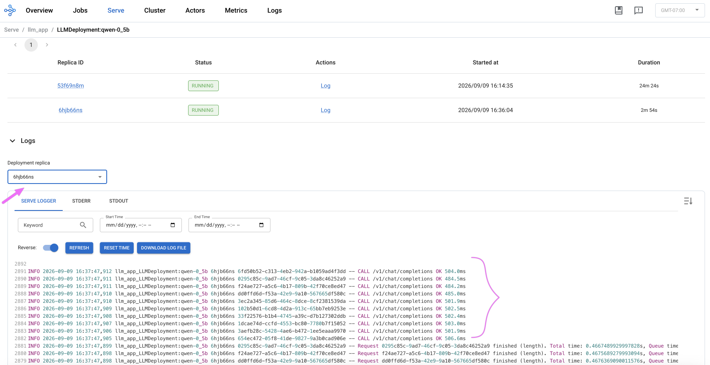
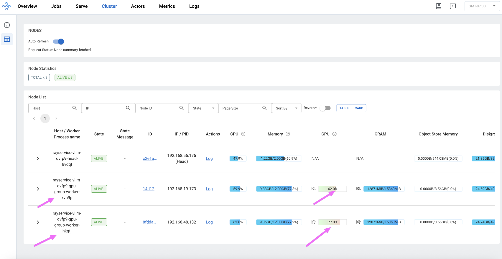

### Finding vLLM's saturation point

A single vLLM replica turned out not to be the bottleneck at the original benchmark's concurrency levels
(1-16) — its latency stayed almost flat across that whole range (0.65s → 0.92s), meaning continuous batching
was absorbing the extra concurrent requests without breaking a sweat. With headroom left on a single replica,
2 replicas couldn't show any measurable benefit yet — so the sweep was extended to higher concurrency to find
where a single replica actually saturates, and confirm 2 replicas keep scaling past that point.

#### Side note: a dip that didn't reproduce

The first run at these levels showed an odd dip at concurrency 128 (32.6 req/s, below 64's 35.0) that did
*not* reproduce in an immediate re-run (128 came back at 40.7 req/s, above 64 as expected) — a reminder that
a single sample at high concurrency is noisy (likely `kubectl port-forward` tunnel jitter, not a real system
characteristic). The table below uses the reproducible re-run's numbers.

The table also includes the matching 1-replica sweep, run right after Serve's autoscaler happened to scale
back down to 1 replica:

| Concurrency | 1-replica (vLLM) throughput (req/s) | 1-replica (vLLM) latency avg (s) | 2-replica (vLLM) throughput (req/s) | 2-replica (vLLM) latency avg (s) |
|---|---|---|---|---|
| 1   | 1.53  | 0.65 | 1.53  | 0.65 |
| 2   | 2.98  | 0.67 | 2.92  | 0.68 |
| 4   | 5.49  | 0.73 | 5.45  | 0.71 |
| 8   | 9.49  | 0.78 | 11.15 | 0.71 |
| 16  | 16.74 | 0.93 | 17.94 | 0.81 |
| 32  | 15.39 | 1.42 | 31.43 | 0.95 |
| 64  | 19.40 | 2.14 | 35.81 | 1.32 |
| 128 | 21.97 | 3.52 | 40.66 | 2.04 |
| 256 | 20.82 | 6.40 | 45.01 | 3.53 |

Through concurrency 16, the two are essentially tied — consistent with the earlier finding that a single
replica wasn't saturated yet at that level, so a second replica had nothing to relieve. Past 16 they split
hard: **1-replica throughput plateaus and gets noisy** (15.4 → 19.4 → 22.0 → 20.8, never breaking much past
~20 req/s) while its **latency balloons 7x** (0.93s → 6.40s). **2-replica keeps scaling cleanly** to 45 req/s,
with latency growing far more gently. That divergence — not just the 2-replica curve in isolation — is the
actual proof that a second replica extends the system's capacity rather than just adding idle redundancy.

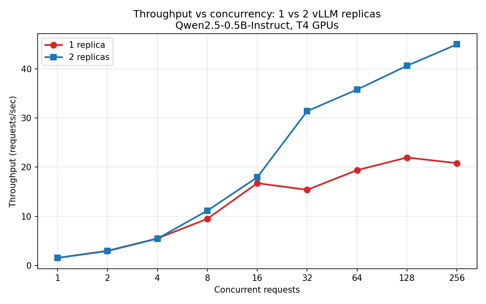
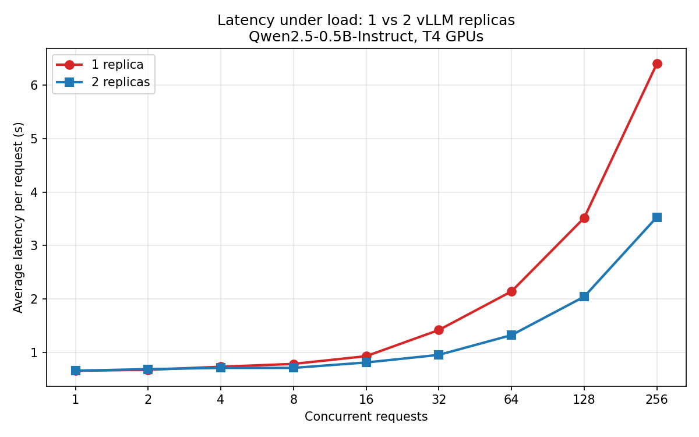

## Bonus: a small chat UI

Same idea as phase 3's [Gradio chat UI](../03-aws-eks/README.md#bonus-a-small-chat-ui), adapted for the
OpenAI-compatible API — [`ui/chat_ui.py`](ui/chat_ui.py) uses the `openai` Python client directly against
`/v1/chat/completions`, rather than raw `requests` against a custom endpoint.

One genuine improvement that came free with the engine swap: phase 3's chat UI couldn't maintain
conversation history, since its custom `/generate` contract only ever sent a single prompt string. The
OpenAI-compatible `messages` array supports multi-turn conversations natively, so phase 4's chat UI builds
the full conversation history into each request — the model can now actually recall earlier turns in the
same session.

```bash
cd ui
pip install -r requirements.txt
kubectl port-forward svc/rayservice-vllm-serve-svc 8000:8000   # separate terminal, keep running
./run_ui.sh
```

One real bug surfaced on first live test: Gradio's `ChatInterface` history sometimes stores message `content`
as a list of content-part dicts (`[{"type": "text", "text": "..."}]`, mirroring OpenAI's multimodal
content-parts shape) rather than a plain string. `ray.serve.llm`'s server-side `Message` model only accepts
`content: str | None`, so resending that shape on the second turn threw a `pydantic` validation error
(`Value error, content must be a string or None`) — visible only in the replica's **STDERR** log tab, not the
access-log "Serve Logger" tab used everywhere else in this doc. Fixed by flattening content back to a plain
string in `to_messages()` regardless of which shape it arrives in.

Confirmed working — the model correctly tracks context across three turns without repeating "West Coast":

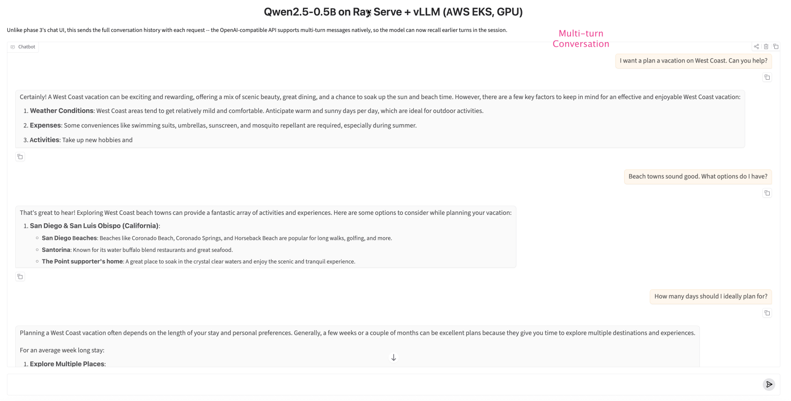
