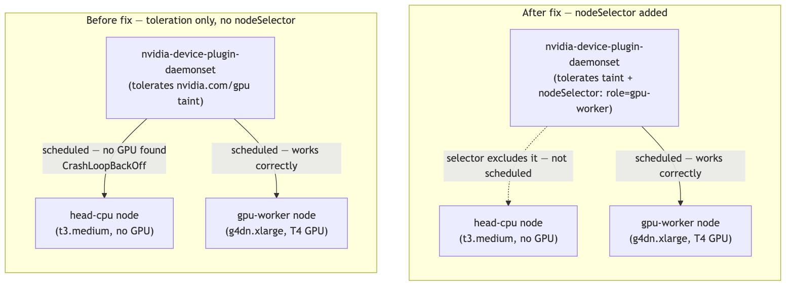

<!--
Filed: https://github.com/eksctl-io/eksctl/issues/8858
-->

## Title

[Bug] nvidia-device-plugin-daemonset has no nodeSelector, gets scheduled onto non-GPU nodes too (and can take
down an unrelated node with DiskPressure)

## What I was doing

Small side project, nothing fancy: one EKS cluster, two managed node groups — a `t3.medium` for the Ray head
process (no GPU needed there) and a `g4dn.xlarge` for the actual model. Standard "keep the cheap stuff off
the expensive node" split.

```yaml
managedNodeGroups:
  - name: head-cpu
    instanceType: t3.medium
    desiredCapacity: 1
    minSize: 1
    maxSize: 1
    volumeSize: 20
    labels:
      role: head

  - name: gpu-worker
    instanceType: g4dn.xlarge
    desiredCapacity: 1
    minSize: 1
    maxSize: 2
    volumeSize: 50
    labels:
      role: gpu-worker
```

`eksctl create cluster -f eksctl-cluster.yaml`, eksctl `0.230.0`, EKS `1.31`. eksctl noticed the GPU instance
type and auto-installed the NVIDIA device plugin, same as it's supposed to.

## What went wrong

My head pod (the one that's never supposed to touch a GPU) sat `Pending` forever. `kubectl describe pod`
pointed at a `disk-pressure` taint on the head-cpu node, which was strange for a node doing almost nothing.
Turned out the auto-installed `nvidia-device-plugin-daemonset` had landed a replica on that node too, and it
had been `CrashLoopBackOff` for a while — no GPU there for it to find, so of course it kept failing — and all
those restarts had quietly filled up the disk until kubelet tainted the node.

Once I actually looked at the daemonset, the reason was obvious:

```
$ kubectl get daemonset nvidia-device-plugin-daemonset -n kube-system -o yaml
...
      tolerations:
      - effect: NoSchedule
        key: nvidia.com/gpu
        operator: Exists
```

That's it. A toleration, no nodeSelector. A toleration just means "you're *allowed* to land here if you get
scheduled here" — it doesn't mean "only schedule me here." With nothing else constraining it, Kubernetes put
a copy on every node in the cluster, GPU or not.



So this isn't just "the plugin does nothing useful on a CPU node and that's fine" — it actively broke
scheduling on a node that had nothing to do with it.

## The closest existing docs

The [GPU support page](https://docs.aws.amazon.com/eks/latest/eksctl/gpu-support.html) does mention
something adjacent:

> If you use different AMI families in your cluster's configurations, you may need to use taints and
> tolerations to keep the device plugin from running on Bottlerocket nodes.

But that's specifically about Bottlerocket mixed with something else. My cluster has zero Bottlerocket in
it — both node groups are plain Amazon Linux 2023, one just happens to have a GPU. That combination (an
ordinary CPU/GPU split, no Bottlerocket involved) doesn't seem to be covered anywhere, and the actual fix
(a nodeSelector, not just a toleration) isn't mentioned either.

I also checked for existing issues before writing this up. The closest I found is
[#8550](https://github.com/eksctl-io/eksctl/issues/8550) / [#8627](https://github.com/eksctl-io/eksctl/pull/8627)
("AL2023 AMI breaks toleration support"), but that's the opposite problem — the plugin *not* getting
tolerations it needed on AL2023 GPU nodes. Mine is about it running somewhere it has no business being, on
any AMI family.

## Where I think this lives in the code

`pkg/addons/device_plugin.go` — `NvidiaDevicePlugin.SetTolerations` walks `NodeGroups`/`ManagedNodeGroups`,
finds the ones that are NVIDIA instance types, and adds tolerations for their taints. There's no equivalent
method that restricts the DaemonSet the other direction — nothing builds a nodeSelector or affinity so it
only lands on those same node groups. The permission half exists; the restriction half doesn't.

Confirmed the fix works by hand:

```bash
kubectl patch daemonset nvidia-device-plugin-daemonset -n kube-system --type merge \
  -p '{"spec":{"template":{"spec":{"nodeSelector":{"role":"gpu-worker"}}}}}'
```

after which the daemonset has both the original toleration and my added selector, and only schedules onto
the GPU node group.

## Happy to try fixing this, if it's welcome

I'm fairly new to this codebase, so please take the following as a tentative first impression rather than a
firm proposal.

Poking around a bit, it looks like the EFA and Neuron device plugins already handle something like this —
their manifests (`pkg/addons/assets/efa-device-plugin.yaml`, `neuron-device-plugin.yaml`) each have a
hardcoded `nodeAffinity` listing the capable instance types by name, directly in the YAML. So there's
precedent for a static-list approach, and that might just be the preferred style here.

The one thing giving me pause about copying that for Nvidia is `instance.IsNvidiaInstanceType`, which reads
from `InstanceTypesMap` in
[`pkg/utils/instance/instance_types.go`](https://github.com/eksctl-io/eksctl/blob/main/pkg/utils/instance/instance_types.go) —
a 13,611-line table auto-generated by `ec2geninfo`. That's a lot bigger than EFA/Neuron's lists, so hand-copying
instance types out of it into a static YAML list felt like it might be missing the point of having a
generated table in the first place — but I could easily be wrong about that, or missing some reason it's
still the preferred approach.

If it'd be useful, I'd be glad to take a pass at a `SetNodeSelector` method alongside `SetTolerations` (reusing
the same node-group walk and `IsNvidiaInstanceType` check), but I'd really rather get a maintainer's read on
the right direction first — both because I don't want to guess wrong on style/architecture, and because
there may be history here I'm not aware of. No worries at all if the preference is to just take the bug
report and handle it however's easiest on your end.

---

## Follow-up comment (posted after realizing the issue template asks for more)

A few things the bug report template asks for that I missed in the original writeup — adding them here:

**Versions**

```
$ eksctl info
eksctl version: 0.230.0
kubectl version: v1.37.0
OS: darwin
```

**Anything else**

- Installed via Homebrew (`brew install eksctl`), not a downloaded binary or compiled from source.
- macOS 15.7.9 (Darwin), running `eksctl create cluster` from a local machine, not CI.
- Default AWS CLI credentials (default profile via `~/.aws/config`), no MFA, no named profile involved.

**On verbose logs (`-v 4`)** — I don't have these archived from when this originally happened, and
recreating the exact crash-loop again just to capture `-v 4` output would mean spinning up a fresh cluster
for it. Happy to do that if it'd actually help diagnose something, but the root cause here seemed clear
enough from the DaemonSet's own YAML (no `nodeSelector` present) that I wasn't sure it was necessary. Let me
know if it'd still be useful and I'll go generate it.
